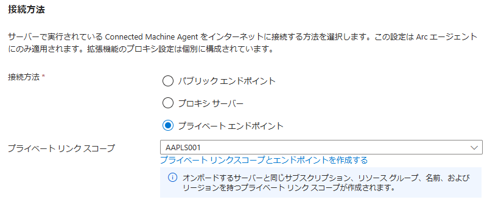
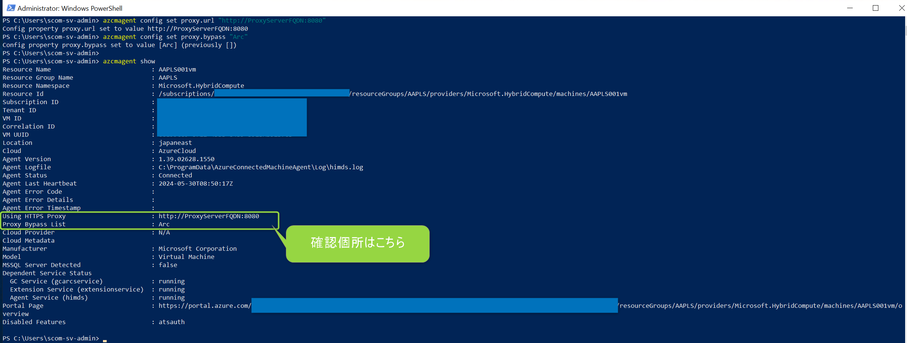

<!-- more -->
こんにちは、Azure Monitoring チームの 佐藤 です。
当ページでは、Azure Arc のオンボードスクリプトの留意点について説明します。

Azure Arc にオンボードできる OS やソフトウェアには幾つか種類がございますが、当ページでは Windows マシンを主に、一部 Linux マシンをオンボードすることも含めて解説します。
また、オンボードするためのスクリプトの種別は以下 3 点ございますが、本日は多くのお問い合わせを頂戴する ”単一サーバーの追加” について解説いたします。
- 単一サーバーの追加
- 複数のサーバーの追加 
- Update Management でサーバーを追加する

まず基本のオンボードの流れは以下の当社公開ページに記載しております。
[クイックスタート: Azure Arc 対応サーバーにハイブリッド マシンを接続する](https://learn.microsoft.com/ja-jp/azure/azure-arc/servers/learn/quick-enable-hybrid-vm)

上記ページに記載のように Azure ポータル上で作成いただいたスクリプトをオンボードさせたいマシン上で実行する運びとなります。

# オンボードスクリプトの概要
失敗事例と改善策をお伝えする前に一度オンボードスクリプトの内容を解説いたします。

## Windows マシン向けスクリプトについて
下図 1 の通り大まかな流れとしては接続先の情報を変数に代入した後、Connected Machine エージェントをインストールするため、install_windows_azcmagent.ps1 がダウンロードされ、実行されます。
その後、インストールされた Connected Machine エージェントの実行ファイルを使用してオンボード処理をしております。
尚、install_windows_azcmagent.ps1 の内容は [こちら](https://gbl.his.arc.azure.com/installationScripts?api-version=1.0-preview&platform=windows) からご確認いただくことが可能です。
内容の詳細は割愛しますが、この中でエージェントのインストーラファイル”AzureConnectedMachineAgent.msi”がダウンロードされ、その後実行されます。
■図 1. Windows マシン向けのスクリプト

## Linux マシン向けスクリプトについて
下図 2 が Linux 向けとなりますが、Windows 向けと同じと流れとなります。
■図 2. Linux マシン向けのスクリプト

# 留意点・失敗事例について

## 留意点 1：proxy サーバーを経由し、且つプラベート エンドポイントへ接続するシナリオ
Azure ポータル画面でスクリプト作成の条件を設定いただいている中で下図 3 の箇所がございます。
お客様環境に依ってはプロキシ サーバーを経由し、且つプラベート エンドポイントへ接続する用件があるかと存じます。
その場合、自動で作成されるスクリプトでは動作しないため、まずは下図 3 のように ”プラベート エンドポイント”を選択して、スクリプトのダウンロードまでお進みください。

■図 3. 接続方法の設定個所の画面

上記シナリオの場合以下のような手順でお進みください。

### step 1：エージェントのインストール
最新のエージェントインストーラを [こちら](https://learn.microsoft.com/ja-jp/azure/azure-arc/servers/agent-overview#agent-resources) ページの手順でダウンロードおよびインストールいただき、対象マシンにConnected Machine エージェントをインストールまでお進みください。

### step 2：プロキシ設定
以下ページの手順に従いプロキシ環境向けの設定を行います。
[プロキシ設定の更新または削除](https://learn.microsoft.com/ja-jp/azure/azure-arc/servers/manage-agent?tabs=windows#update-or-remove-proxy-settings) 

ここでプロキシ設定について 2 種類の説明がありますので、ここでも解説いたします。
上記公開ページに記載の通り、エージェントが Arc 関連の通信をする際にプロキシ向けに通信させる方法は以下２つ、両方の設定がされている場合は前者が採用される仕様となっております。
 - エージェント構成（azcmagent config コマンドによる設定）
 - システム環境変数への設定

また注意点として 'netsh winhttp show proxy' コマンドで確認できる Windows システム全体のプロキシ設定が構成されていても”システム環境変数への設定”が無い場合はプロキシサーバー向けに通信されない仕様となります。

そのため上記仕様を踏まえ、どちらの設定をするかご検討いただくようお願いいたします。
推奨は ”エージェント構成（azcmagent config コマンドによる設定）” となります。
尚、'azcmagent config' コマンドは公開情報に ”Bash” と記載されておりますが、エージェントをインストールする Windows 上の PowerShell で実行いただけるコマンドとなります。

設定後に 'azcmagent show' コマンドを実行すると下図 3 のように通信を向けるプロキシサーバーならびに bypass（※）設定を確認いただけます。
■図 4. 'azcmagent config' コマンド および 'azcmagent config' コマンド 実行の画面

※プロキシサーバーに向けない宛先グループ
　Arc と記載されている場合は、プライベートリンク向けの通信はプロキシサーバーへ通信を向けない事を意味します。

### step 3：オンボード
最後に PowerShell を管理者権限で開いていただき、『図 1. Windows マシン向けのスクリプト』の ”接続先情報を変数に定義” および ”Connected Machine エージェントの接続コマンドを実行”をすることでオンボードが可能となります。
図1 のコマンドでなく、ダウンロードしたスクリプトから変数や接続コマンドをコピーして、PowerShell にて 1 行ずつ実行ください。

上記手順によりプロキシサーバーを使用する環境であり、且つプライベート エンドポイントへ接続するご要件を満たすことが可能となります。

