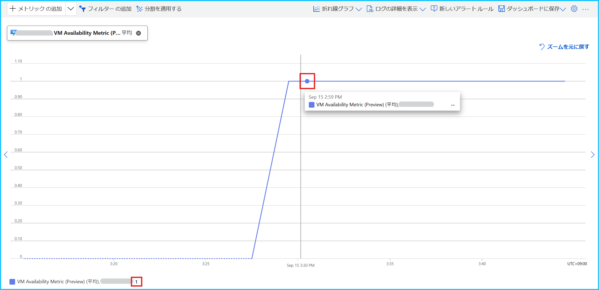
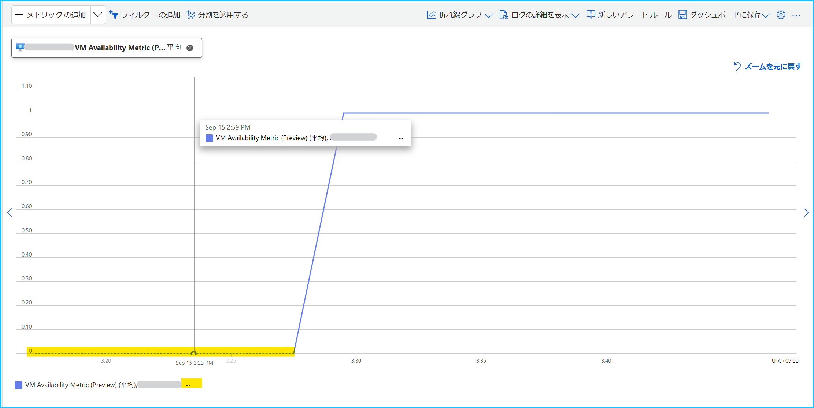

こんにちは、Azure Monitoring チームの北村です。
今回はメトリックがない (NULL) 場合のメトリック アラート ルールの動作について説明します。

 

<!-- more -->
## 目次
- [1. はじめに](#1-はじめに)
- [2. メトリックが NULL の状態とは](#2-メトリックが-NULL-の状態とは)
- [3. メトリックが NULL の場合は評価がスキップされる](#3-メトリックが-NULL-の場合は評価がスキップされる)
- [4. まとめ](#4-まとめ)
 

## 1. はじめに
[メトリック アラート ルール](https://learn.microsoft.com/ja-jp/azure/azure-monitor/alerts/alerts-overview#metric-alerts)でテストを実施したが、しきい値を満たしている状況なのに想定どおりに発報しない・・・というお問い合わせをいただくことがございます。このようなときにご確認いただきたい点は「メトリックが出力されているかどうか」です。
本ブログのタイトルのとおり、メトリック アラート ルールでは「NULL」を検知することはできません。対象の評価期間の間、メトリックが NULL の場合は、アラート ルールが評価をスキップするためです。一方で、評価期間中に一度でも値が記録された場合は、その値をもとに評価が実行されます (評価はスキップされません)。

 

## 2. メトリックが NULL の状態とは
メトリックが「NULL」の状態は、メトリックが何も出力されていないことを意味します。
詳細は [弊社公開情報](https://learn.microsoft.com/ja-jp/azure/azure-monitor/essentials/metrics-aggregation-explained#null-and-zero-values) をご参照いただきたく存じますが、NULL はゼロ値とは異なります。

ここでは Azure VM の[可用性メトリック ‘VM Availability Metric (Preview)’](https://learn.microsoft.com/ja-jp/azure/virtual-machines/monitor-vm-reference#vm-availability-metric-preview) を、折れ線グラフで描画した例に説明します。
この[メトリック](https://jpazmon-integ.github.io/blog/LogAnalytics/VMAvailability-MetricAlert/#2-%E5%8F%AF%E7%94%A8%E6%80%A7%E3%83%A1%E3%83%88%E3%83%AA%E3%83%83%E3%82%AF-%E2%80%98VM-Availability-Metric-Preview-%E2%80%99-%E3%81%A8%E3%81%AF)では VM が実行中の場合は 1 が記録されますが、Azure VM が "停止済み (割り当て解除)" の場合はメトリックの値が NULL になります。

VM が実行している間は 1 が記録されます。

一方で、VM が "停止済み (割り当て解除)" の場合はメトリックが記録されず、破線となっていることがわかります。

> [!NOTE]
> メトリック エクスプローラーの使い方は、[弊社公開情報](https://learn.microsoft.com/ja-jp/azure/azure-monitor/essentials/analyze-metrics) をご参照ください。また、エクスプローラー上で確認した際に値が 0 と表示されていても、アラート ルールの評価時には NULL と認識されるメトリックもございます。メトリックが NULL と判定されたことにより評価がスキップされていると推測される場合には、一度対象のメトリックを意図的に記録いただき、アラートが検知するかどうかをご確認いただきますようお願いいたします。

 

## 3. メトリックが NULL の場合は評価がスキップされる
冒頭でもお伝えしたとおり、メトリック アラート ルールは、評価期間の間、メトリックがずっと NULL の場合は評価をスキップします。以下に例を示します。

**例 1.**
00:00  NULL
00:01  NULL
00:02  NULL
00:03  NULL
00:04  NULL

例えば、上記のようにメトリックが出力されていない状況だったとします。
この状態で、アラート ルールが 00:00 ~ 00:04 のメトリックを対象に評価したとします。
このとき、対象の期間メトリックはずっと NULL のため、アラート ルールはこの評価をスキップします。このため、アラートを検知することはありません。

**例 2.**
00:00  NULL
00:01  1
00:02  NULL
00:03  0
00:04  NULL

例えば、00:01 と 00:03 にメトリックが記録され、それ以外は NULL だったとします。
この状態で、アラート ルールが 00:00 ~ 00:04 のメトリックを対象に評価した場合は、00:01 と 00:03 の値をもとに評価が実行されますので、アラート ルールの評価はスキップされません。

 

## 4. まとめ
メトリック アラート ルールにてテストを実施された際には、メトリックが出力されているかどうかをご確認ください。
もし期待どおりメトリックが出力されていなかった場合は、メトリックが出力されるように一度意図的に Azure リソースを操作ください。メトリックの出力条件について詳細を知りたい場合は、お手数ですが対象の Azure サービス観点でメトリックに関するお問合せをご起票ください。お問合せいただく際には、「なぜメトリックの出力条件が知りたいのか?」について背景をご共有いただくとスムーズなコミュニケーションが期待出来ます。

**<お問い合わせ文の例>**
Azure VM の可用性メトリックを監視するメトリック アラート ルールの動作検証を実施したい。
メトリック値が 1 になる条件は分かるが 0 になる条件が分からず、メトリック アラート ルールの動作検証のために可用性メトリックが 0 となる条件について知りたいです。

 

上記の内容以外でご不明な点や疑問点などございましたら、弊社サポート サービスまでお問い合わせください。
最後までお読みいただきありがとうございました！