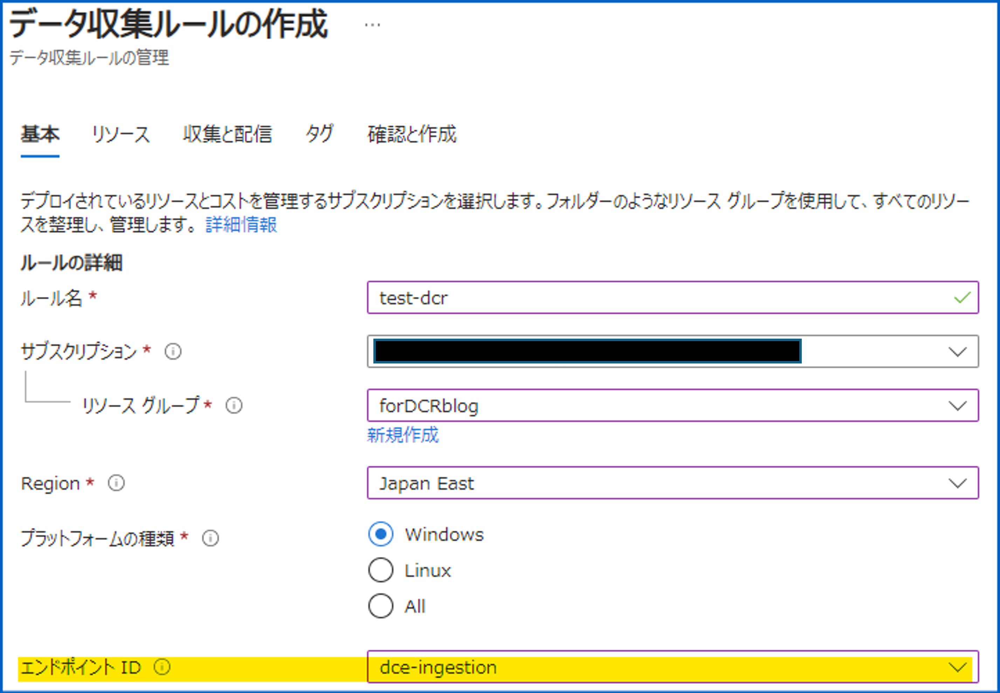
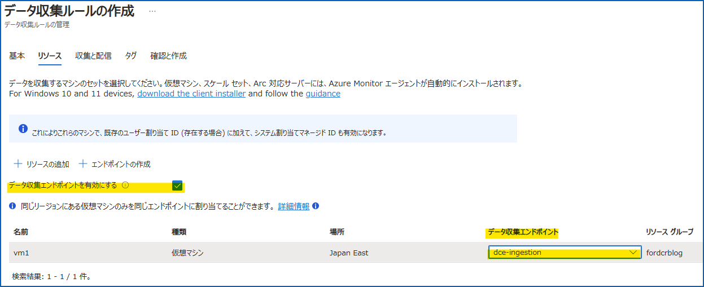
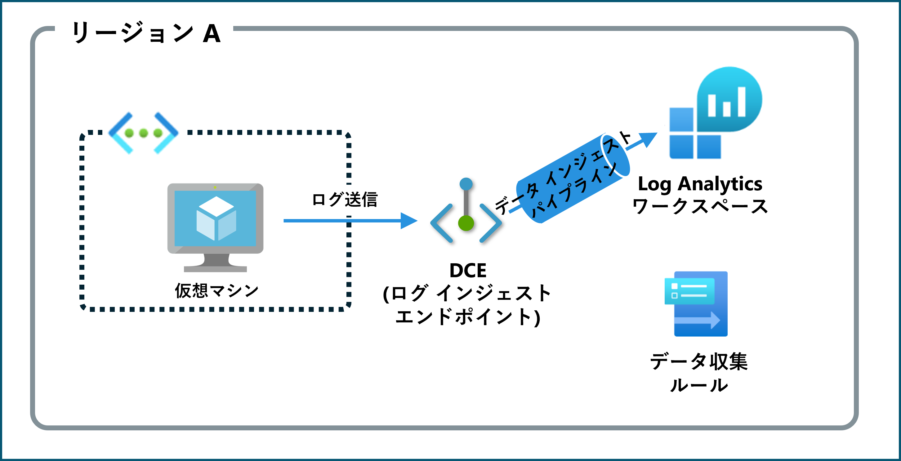
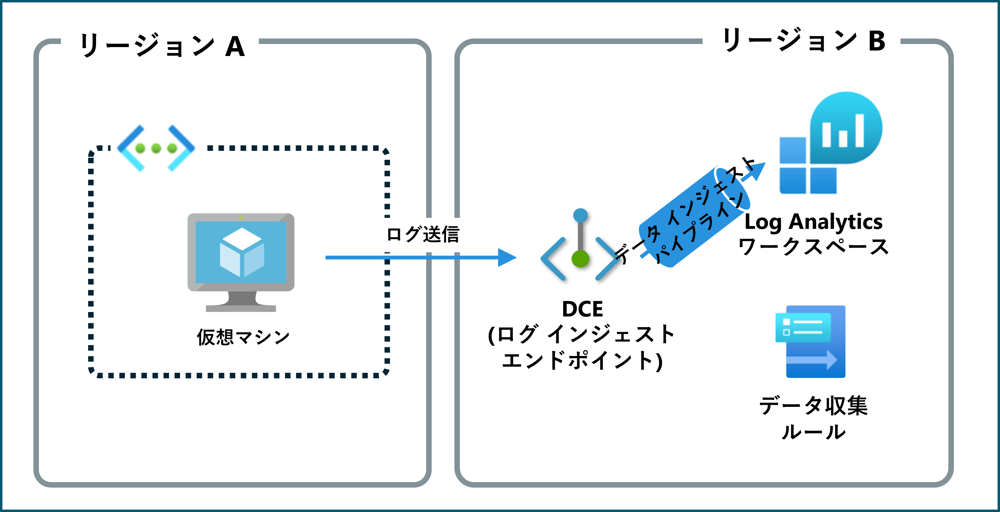
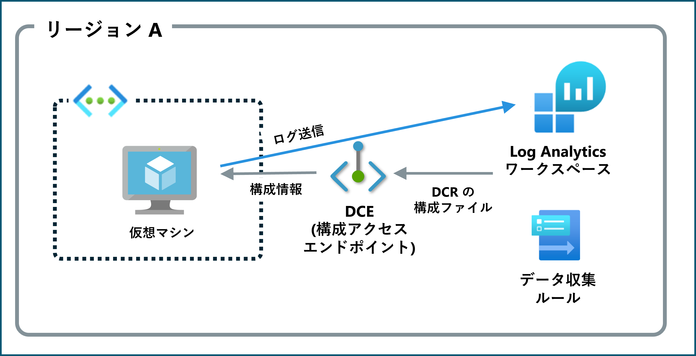
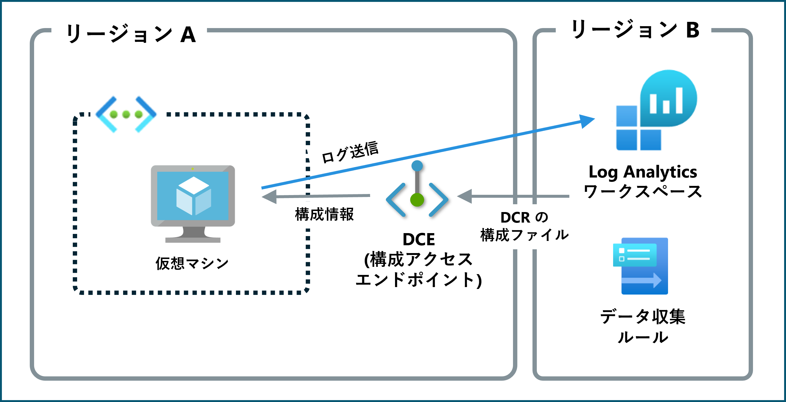
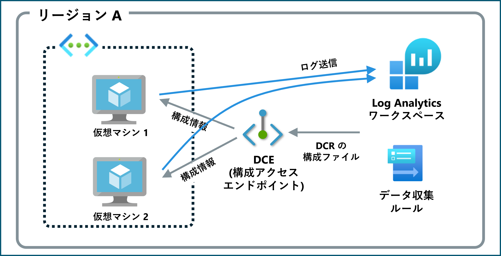
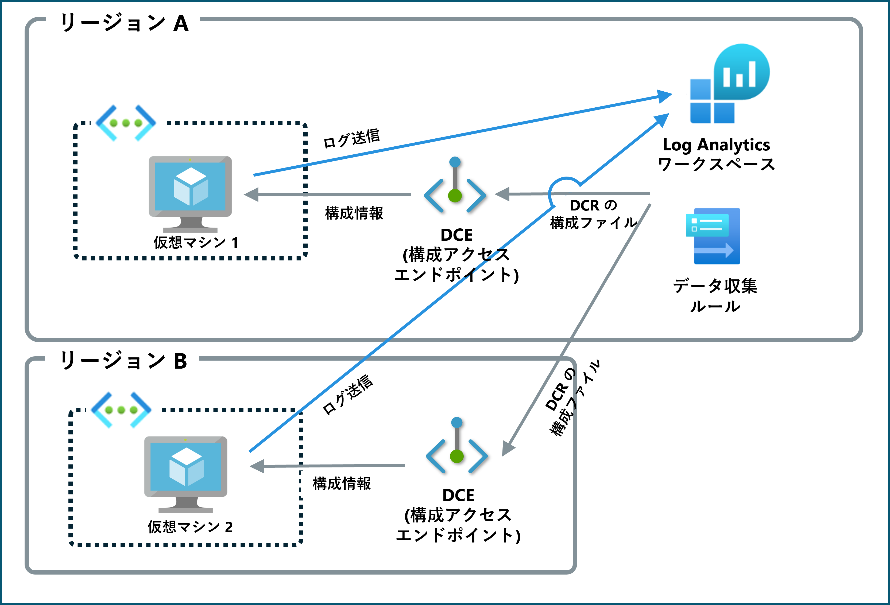
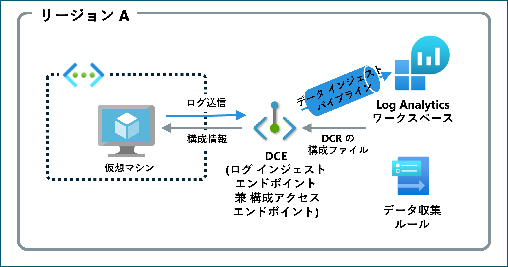

こんにちは、Azure Monitoring チームの徳田です。

本ブログでは、以下の公開情報に記載されていますデータ収集エンドポイントについて、その設定方法、利用目的、設定時の制限事項を、具体例を用いてご説明します。

https://learn.microsoft.com/ja-jp/azure/azure-monitor/essentials/data-collection-endpoint-overview?tabs=portal
<!-- more -->

## 目次
- はじめに
- データ収集エンドポイント (DCE) とは
- データ収集ルールが使用するエンドポイントの種類
  - ログ インジェスト エンドポイント
  - メトリック インジェスト エンドポイント
  - 構成アクセス エンドポイント
- データ収集エンドポイントの 2 種類の設定箇所
  - データ収集ルールの作成 [基本] タブ
    - 設定方法
    - 目的
    - 制限事項
  - データ収集ルールの作成 [リソース] タブ
    - 設定方法
    - 目的
    - 制限事項
- 具体的なシナリオにおけるデータ収集エンドポイントの構成
- データ収集エンドポイントに関する FAQ
- まとめ

## はじめに
Azure Monitor エージェントを使用してログやメトリックを収集する場合、どのようなログを収集するのかはデータ収集ルール (DCR) を使用して設定します。  
データ収集ルールを作成する際、データ収集エンドポイントを設定できる箇所が 2 つあります。  
今回は、それぞれで設定できるデータ収集エンドポイントの違いを説明するとともに、具体的な例を用いて、どのようにそれぞれのエンドポイントを構成すればよいのかをご紹介します。

## データ収集エンドポイント (DCE) とは
データ収集エンドポイント (DCE) は、Azure Monitor エージェントなどのデータ ソースが収集したデータを、処理して Azure Monitor に送信する際の接続を担います。

## データ収集ルールが使用するエンドポイントの種類
### ログ インジェスト エンドポイント
ログをデータ インジェスト パイプラインに取り込むエンドポイントです。  
[カスタム ログ](https://learn.microsoft.com/ja-jp/azure/azure-monitor/agents/data-collection-text-log?tabs=portal)、および [IIS ログ](https://learn.microsoft.com/ja-jp/azure/azure-monitor/agents/data-collection-iis)を取り込む際または[ログ インジェスト API](https://learn.microsoft.com/ja-jp/azure/azure-monitor/logs/logs-ingestion-api-overview)を使用してログ収集を行いたい場合に必要です。

### メトリック インジェスト エンドポイント
メトリックをデータ インジェスト パイプラインに取り込むエンドポイントです。  
エンドポイントを介してデータ インジェスト パイプラインに取り込まれたメトリックは、データ収集ルールで設定された [Azure Monitor ワークスペース](https://learn.microsoft.com/ja-jp/azure/azure-monitor/essentials/azure-monitor-workspace-overview)とテーブルに送信されます。

Azure Monitor ワークスペースとは

Azure Monitor が収集したメトリック データが収集されます。2024 年 7 月時点では、Prometheus に関連するメトリックのみが収集対象です。

### 構成アクセス エンドポイント
Azure Monitor エージェントがデータ収集ルールの構成情報を取得するためのエンドポイントです。  
データ収集元となる仮想マシン (以下、VM) に紐づけられます。  
[Azure Monitor Private Link Scope (AMPLS)](https://learn.microsoft.com/ja-jp/azure/azure-monitor/logs/private-link-security) を使用してログ収集を行いたい場合に必要です。

## データ収集エンドポイントの 2 種類の設定箇所
"データ収集ルールが使用するエンドポイントの種類" でご紹介したそれぞれのエンドポイントは、データ収集ルール作成時に設定することが可能です。
その方法をご紹介します。

### データ収集ルールの作成 - [基本] タブ
#### 設定方法
Azure portal のデータ収集ルールの作成手順における [基本] タブで設定します。
以下画像に示す、"エンドポイント ID" で設定します。

#### 目的
ログ インジェスト エンドポイントおよびメトリック インジェスト エンドポイント を設定します。

#### 制限事項
* 送信先の Log Analytics ワークスペース (メトリックを収集する場合は Azure Monitor ワークスペース)、およびデータ収集ルールと同じリージョンに存在する必要があります。

#### 補足 1 : ログ インジェスト エンドポイントの設定について
ログ インジェスト API を使用しない場合、およびカスタム ログ、IIS ログの収集を行わない場合、このデータ収集エンドポイントの設定は必要ありません。  
この場合、ログは Log Analytics ワークスペース リソース固有のエンドポイントを介して収集されます。

#### 補足 2 : メトリック インジェスト エンドポイントの設定について
2024 年 7 月時点で、Prometheus メトリックを Azure Monitor ワークスペースに収集するデータ収集ルールを作成すると、自動的にそのデータ収集ルールに、メトリック インジェスト エンドポイントとしての DCE が新規作成され紐づけられます (すなわちお客様ご自身で作成し、紐づける必要はございません) 。
この自動で DCE が作成され紐づけられる仕様は、ログ インジェスト エンドポイントとは異なります。  
そのため、以降本 blog 内では [基本] タブで設定する DCE はログ インジェスト エンドポイント用の DCE として扱います。  
尚、Prometheus メトリックの収集方法については、下記の参考情報をご確認ください。  

(参考情報) Prometheus 用の Azure Monitor マネージド サービス
https://learn.microsoft.com/ja-jp/azure/azure-monitor/essentials/prometheus-metrics-overview#enable

### データ収集ルールの作成 - [リソース] タブ
#### 設定方法
Azure portal のデータ収集ルールの作成手順における [リソース] タブで設定します。  
以下画像に示す "データ収集エンドポイントを有効にする" のチェック ボックスにチェックを入れ、"データ収集エンドポイント" 列でエンドポイントを設定します。

#### 目的
構成アクセス エンドポイントを設定します。

#### 制限事項
* 収集元の VM と同じリージョンに存在する必要があります。
* 1 つの VM に複数の DCE を紐づけることはできません。

#### 補足
Azure Private Link Scope (APMPLS) を使用せずにログ収集を行う場合、このデータ収集エンドポイントの設定は必要ありません。  
この場合、Azure Monitor エージェントはグローバルまたはリージョン共通の構成アクセス エンドポイント (下記参考情報のハイライト箇所) を介して構成情報を取得します。

(参考情報) ファイアウォールの要件

https://learn.microsoft.com/ja-jp/azure/azure-monitor/agents/azure-monitor-agent-data-collection-endpoint?tabs=PowerShellWindows#firewall-requirements

## 具体的なシナリオ
※ このセクションでは、メトリックの収集を行わないシナリオをご紹介します。メトリックの収集を行いたい場合は、[基本] タブで設定するデータ収集エンドポイントと収集先の Azure Monitor ワークスペースを同じリージョンに配置する必要があります ([データ収集ルールの作成 - [基本] タブ](#データ収集ルールの作成---基本-タブ))。

### ログ インジェスト API を使用したい / カスタム ログ または IIS ログを収集したい
* ログ インジェスト エンドポイント用の DCE が必要です。
* DCE はそれと紐づけを行うデータ収集ルールと送信先 Log Analytics ワークスペースと同じリージョンに存在している必要があります。

#### 例 1

#### 例 2

### Azure Private Link Scope を使用してログを収集したい
* 構成アクセス エンドポイント用の DCE が必要です。
* DCE はデータ収集元の VM と同じリージョンに存在している必要があります

※ 以降の図内では、簡略化のためグローバル/リージョン共通のログ インジェスト エンドポイントを省略しております。

#### 例 1

#### 例 2

#### 例 3

#### 例 4

### ログ インジェスト API が使用したい / カスタム ログ または IIS ログを収集したい かつ Azure Private Link Scope を使用してログを収集したい
* ログ インジェスト エンドポイント用の DCE と構成アクセス エンドポイント用の DCE が必要です。
* VM、 Log Analytics ワークスペース、データ収集ルールが同じリージョンに存在する場合、これらと同じリージョンに存在する DCE 1 つをログ インジェスト エンドポイントと構成アクセス エンドポイントの両方に使用できます。

## データ収集エンドポイントに関する FAQ
**Q1.** 既存のデータ収集エンドポイントが 1 つ存在する場合、それをデータ収集ルール作成時の [基本] タブと [リソース] の両方で指定することはできますか？
***

**A1.** はい、可能です。  
ただし、この場合はデータ収集ルール、送信先 Log Analytics ワークスペース (メトリック収集の場合は Azure Monitor ワークスペース)、送信元 VM、データ収集エンドポイントがすべて同じリージョンに存在する必要があります。

**Q2.** 最低限必要なデータ収集エンドポイントの数が分かりません。どのように考えればよいですか？
***
**A2.** ログ インジェスト エンドポイント (メトリック収集の場合はメトリック インジェスト エンドポイント)、構成アクセス エンドポイントのどちらが必要かによって考え方が異なります。  

ログ インジェスト エンドポイント (メトリック インジェスト エンドポイント) だけが必要な場合、必要な DCE の最低数は、送信先の Log Analytics ワークスペース (Azure Monitor ワークスペース) と使用するデータ収集ルールが存在するリージョンの数です。  
この際、1 つの Log Analytics ワークスペース (Azure Monitor ワークスペース) と、それに紐づいているデータ収集ルール, DCE は同じリージョンに存在している必要があります。  

構成アクセス エンドポイントだけが必要な場合、必要な DCE の最低数は送信元の VM が存在しているリージョンの数です。
この際、VM とそれに紐づける DCE は同じリージョンに存在している必要があります (複数の VM に同じ DCE を設定することができます)。

なお、ログ インジェスト エンドポイントおよびメトリック インジェスト エンドポイントと構成アクセス エンドポイントの両方が必要な場合、それぞれのエンドポイントの条件を満たしていれば、 1 つのエンドポイントをログ インジェスト エンドポイントおよびメトリック インジェスト エンドポイントと構成アクセス エンドポイントの両方に使用することが可能です。

**Q3.** データ収集エンドポイントには料金がかかりますか？
***
**A3.** データ収集エンドポイントの使用にあたり、料金は発生しません。

**Q4.** Windows VM と Linux VM, どちらに対しても同じデータ収集エンドポイントを指定できますか？
***
**A4.** OS の種類に関わらず、複数の VM に 1 つのDCE (構成アクセス エンドポイント) を紐づけることが可能です。  
この際も、VM とそれに紐づける DCE は同じリージョンに存在している必要があります。

## まとめ 
データ収集ルールを作成する際、ご自身の環境においてログ インジェスト エンドポイントおよびメトリック インジェスト エンドポイントと構成アクセス エンドポイント、それぞれ設定が必要かどうかを検討する必要があります。  
そして必要なデータ収集エンドポイントの数は Log Analytics ワークスペース (メトリック収集の場合は Azure Monitor ワークスペース) および VM が存在するリージョンによって変化します。