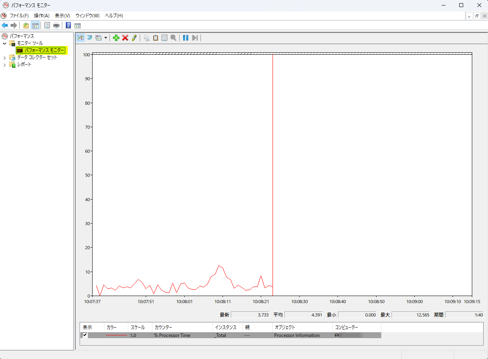
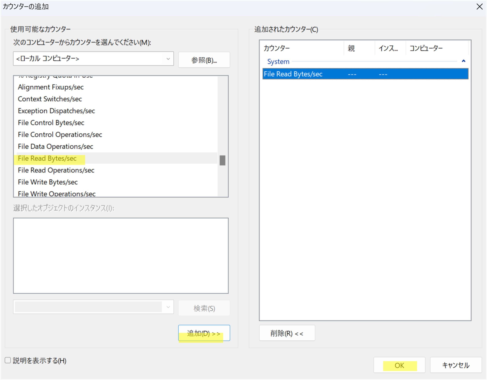
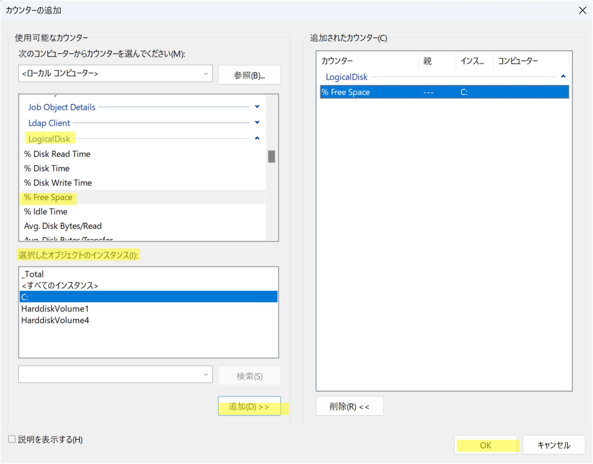
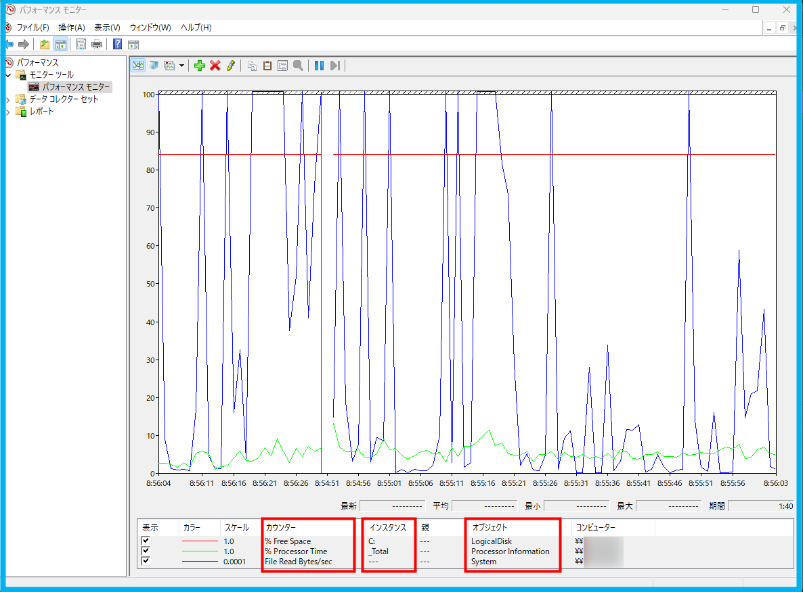
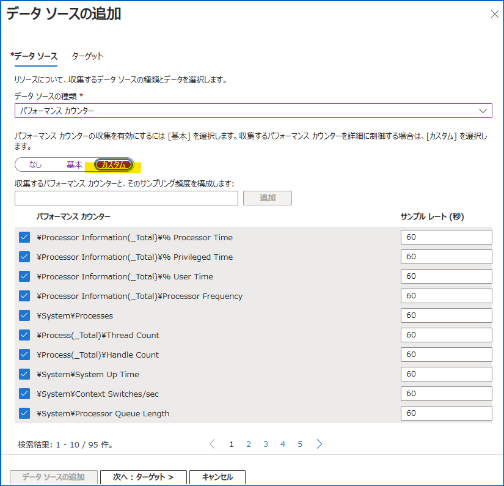
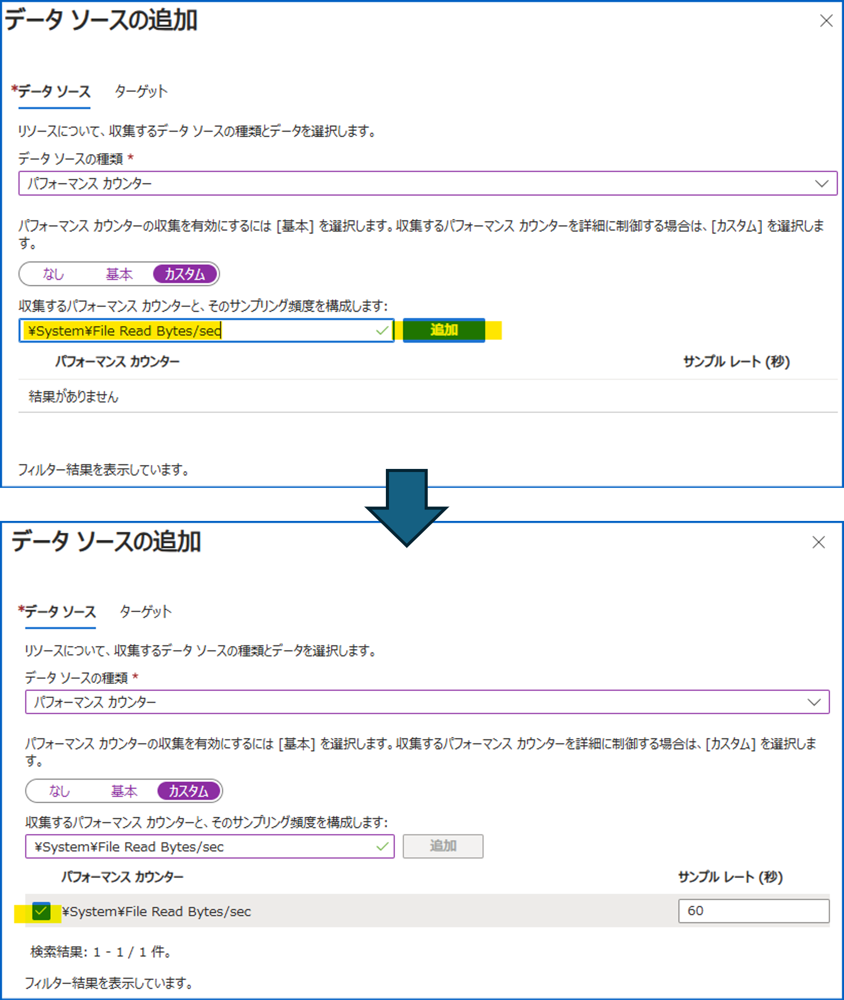
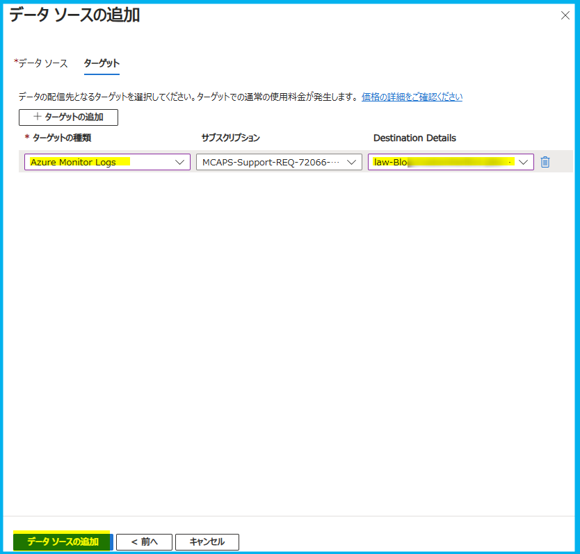
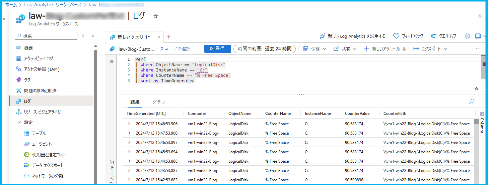

こんにちは、Azure Monitoring チームの徳田です。

本ブログでは、以下の公開情報に記載されています、Azure Monitor エージェントを使用してカスタムのパフォーマンス カウンターを収集するためのデータ収集ルールの作成方法についてご説明します。

https://learn.microsoft.com/ja-jp/azure/azure-monitor/agents/data-collection-performance
<!-- more -->

## 目次
- はじめに
- カスタムのパフォーマンス カウンターの収集手順
  - 事前準備
  - 収集したいパフォーマンス カウンター名の取得
  - データ収集ルールの作成
- まとめ

## はじめに
パフォーマンス カウンターは、データ収集ルール (DCR) のデータ ソースとして使用できるものの 1 つです。  
パフォーマンス カウンターの種類は多数存在し、Azure portal でデフォルトで用意されているものと、そうでないものがあります。
今回は、Azure portal でデフォルトで用意されてないパフォーマンス カウンター (以降、カスタム パフォーマンス カウンター) の収集設定方法についてご紹介します。


## カスタム パフォーマンス カウンターの収集手順
### 事前準備
以下のリソースがご自身の環境にあることを確認してください。
* データ収集元となる Windows OS の仮想マシン (以下 VM)
* データ収集先となる Log Analytics ワークスペース

### パフォーマンス カウンター名を取得する
データ収集ルールのカスタム パフォーマンス カウンターに含まれないパフォーマンス カウンターを取得したい場合、以下の手順に沿って任意のパフォーマンス カウンター名を取得します。  

1. VM のスタート画面で "パフォーマンス モニター" または "Performance Monitor" を検索し、開きます。

2. 左ペインで Monitoring Tools > Performance Monitor (モニター ツール > パフォーマンス モニター) を押下します。ウィンドウ中央に折れ線グラフが表示されます。  


3. 上部 + ボタンを押下し、確認したいパフォーマンス カウンターを押下します。この際、"選択したオブジェクトのインスタンス (I)" に複数の値が表示されている場合は任意のインスタンスも押下します。  
"追加" を押下し、"OK" を押下します。  

例 : パフォーマンス カウンターにインスタンスがない場合
  

例 : パフォーマンス カウンターにインスタンスがある場合



4. 折れ線グラフの下に、選択したパフォーマンス カウンターの一覧が表示されます。  
オブジェクト、インスタンス、カウンター列を参照し、以下のルールに従ってパフォーマンス カウンター名を手元にメモします。  



インスタンスがない場合 : `\<オブジェクト>\<カウンター>`  
    例 : `\System\File Read Bytes/sec`  
    
インスタンスがある場合 : `\<オブジェクト>(<インスタンス>)\<カウンター>`  
    例 : `\LogicalDisk(C:)\% Free Space`

### データ収集ルールを作成する
1. Azure potral にログインします。
2. "deta collection rules" を選択します。
3. "作成" を押下し、"基本" タブの各値を入力します。  
    続いて "リソース" タブで収集元 VM を選択・追加します。
4. "収集と配信" タブで [データ ソースの追加] を押下します。  
    右ペイン内 "データ ソース" タブの "データ ソースの種類" で [パフォーマンス カウンター] を選択します。  
    その下にパフォーマンス カウンターの一覧が表示されます。
5. [カスタム] を押下し、収集したいパフォーマンス カウンターのチェックボックスにチェックを入れます。   
    (2024 年 7 月時点では、デフォルトですべてのカスタム パフォーマンス カウンターのチェックボックスにチェックが入っています。そのため、収集不要なカウンター場合は、そちらのチェックを外していただく必要があります。) 
      
    表示されているパフォーマンス カウンター以外のものを収集したい場合は、[収集したいパフォーマンス カウンター名の取得](#収集したいパフォーマンス-カウンター名の取得) で取得したパフォーマンス カウンター名を入力し、"追加" を押下した後、チェック ボックスにチェックを入れます。
    

6. [次へ : ターゲット >] を押下し、[+ ターゲットの追加] を押下します。  
    "ターゲットの種類" で [Azure Monitor Logs] を選択し、収集先となる Log Analytics ワークスペースを選択し、[データ ソースの追加] を押下します。  
    

7. "確認と作成" タブにて [作成] を押下し、完了です。

### パフォーマンス カウンターが収集されていることを確認する
1. Azure portal にログインします。
2. [データ収集ルールの作成](#データ収集ルールの作成) の 6 で選択した Log Analytics ワークスペースのページを開きます。
3. 左ペインの [ログ] を押下し、以下のクエリを貼り付け、実行します。
    なお、where から始まる行は、収集の有無を確認したいパフォーマンス カウンターのオブジェクト名、インスタンス名、カウンター名に置き換えてください。
```
Perf
| where ObjectName == "オブジェクト名"
| where InstanceName == "インスタンス名"
| where CounterName == "カウンター名"
| sort by TimeGenerated
```
例 : パフォーマンス カウンター名が `\LogicalDisk(C:)\% Free Space` の場合
```
Perf
| where ObjectName == "LogicalDisk"
| where InstanceName == "C:"
| where CounterName == "% Free Space"
| sort by TimeGenerated
```
4. 以下画像のようにログが表示されれば、ログが収集できています。


## まとめ
本ブログではパフォーマンス カウンターおよびカスタム パフォーマンス カウンターの収集設定方法についてご紹介しました。
データ収集ルールでは、収集したいパフォーマンス カウンターのパフォーマンス カウンター名を指定することで、任意のログを収集することができます。