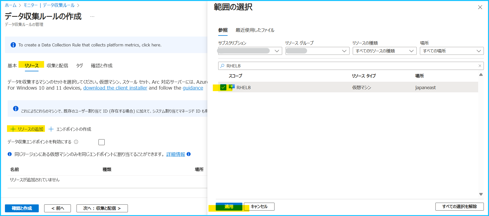
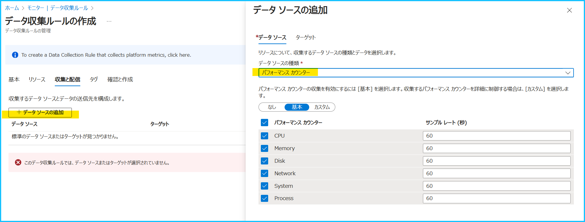
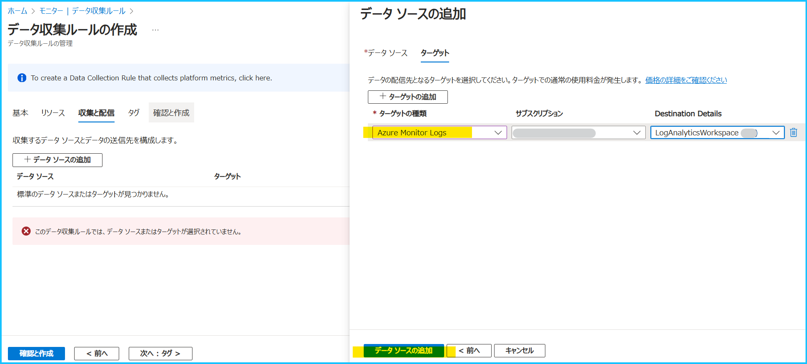
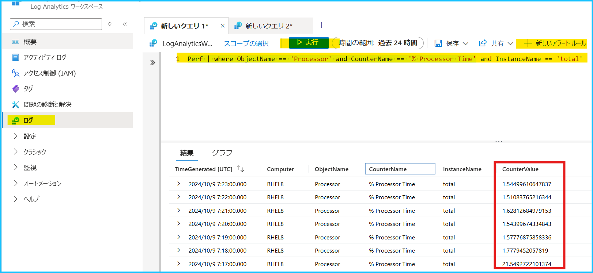
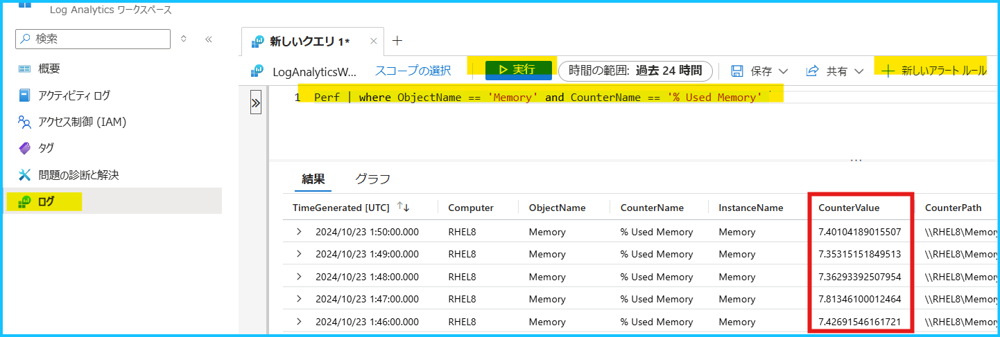

こんにちは、Azure Monitoring サポート チームの北村です。
Linux マシンにおける Azure Monitor エージェントを利用した性能監視（CPU、メモリ、ディスク） の設定手順の一例をご紹介します。なお、本記事は 10/2 に投稿した[<Windows 版> Azure Monitor エージェントを利用した性能監視（CPU、メモリ、ディスク)](https://jpazmon-integ.github.io/blog/LogAnalytics/HowToCreatePerfLogAlertForWin/) の Linux 版です。

 

## 目次
- [1. はじめに](#1-はじめに)
  - [1-1. ログ アラート ルールとは](#1-1-ログ-アラート-ルールとは)
  - [1-2. Azure Monitor エージェントを利用した ログ アラート ルールの設定の流れ](#1-2-Azure-Monitor-エージェントを利用した-ログ-アラート-ルールの設定の流れ)
  - [1-3. 本ブログで紹介する内容の前提](#1-3-本ブログで紹介する内容の前提)
- [2. 性能監視（CPU、メモリ、ディスク） に関するパフォーマンス カウンター](2-性能監視（CPU、メモリ、ディスク）-に関するパフォーマンス-カウンター)
- [3. パフォーマンス カウンターのデータ収集ルール](#3-パフォーマンス-カウンターのデータ収集ルール)
  - [3-1. 既定で用意されているパフォーマンス カウンターについて](#3-1-既定で用意されているパフォーマンス-カウンターについて)
  - [3-2. パフォーマンス カウンターのデータ収集ルール設定手順](#3-2-パフォーマンス-カウンターのデータ収集ルール設定手順)
- [4. ログ アラート ルールの主な設定項目](#4-ログ-アラート-ルールの主な設定項目)
- [5. CPU 使用率を監視するログ アラート ルール](#5-CPU-使用率を監視するログ-アラート-ルール)
  - [5-1. CPU 使用率のログ アラート ルールの設定例](#5-1-CPU-使用率のログ-アラート-ルールの設定例)
  - [5-2. CPU 使用率のログ アラート ルールの設定手順](#5-2-CPU-使用率のログ-アラート-ルールの設定手順)
- [6. メモリ使用率を監視するログ アラート ルール](#6-メモリ使用率を監視するログ-アラート-ルール)
  - [6-1. メモリ使用率のログ アラート ルールの設定例](#6-1-メモリ使用率のログ-アラート-ルールの設定例)
  - [6-2. メモリ使用率のログ アラート ルールの設定手順](#6-2-メモリ使用率のログ-アラート-ルールの設定手順)
- [7. ディスク空き容量率を監視するログ アラート ルール](#7-ディスク空き容量率を監視するログ-アラート-ルール)
  - [7-1. ディスク空き容量率のログ アラート ルールの設定例](#7-1-ディスク空き容量率のログ-アラート-ルールの設定例)
  - [7-2. ディスク空き容量率のログ アラート ルールの設定手順](#7-2-ディスク空き容量率のログ-アラート-ルールの設定手順)

 

## 1. はじめに

### 1-1. ログ アラート ルールとは
本ブログでは Red Hat Enterprise Linux 8.8 (LVM) の Azure VM に Azure Monitor エージェントを導入し、当該 VM からパフォーマンス カウンターの情報を収集して CPU 使用率やメモリ使用率、ディスク使用率を監視する「ログ アラート ルール」の設定手順を紹介します。

[ログ アラート ルール](https://learn.microsoft.com/ja-jp/azure/azure-monitor/alerts/alerts-types#log-alerts)とは、Log Analytics ワークスペースに収集したデータを評価し、条件が満たされたときにアラートを発報します。監視要件に応じてログ クエリを設定し、アラートの条件を定義することで、しきい値を満たしたときに[電子メールや SMS 等に通知する](https://learn.microsoft.com/ja-jp/azure/azure-monitor/alerts/action-groups)ことができます。例えば、Azure VM からイベント ログを収集し、5 分単位でログの評価を行い、特定のイベント ログが出力されたときにアラートを発報する、といったことが可能です。

> [!NOTE]
> Azure Monitor エージェントではパフォーマンス カウンターを[メトリック](https://learn.microsoft.com/ja-jp/azure/azure-monitor/vm/tutorial-monitor-vm-guest#view-guest-metrics)として収集することも可能です。そのため、ログ アラート ルールではなく、[メトリック アラート ルール](https://learn.microsoft.com/ja-jp/azure/azure-monitor/essentials/tutorial-metrics)でも同様の内容を監視することができます。

 

### 1-2. Azure Monitor エージェントを利用した ログ アラート ルールの設定の流れ
ログ アラート ルールを作成するための基本的な流れを説明します。
本ブログでは 2. および 3. の手順を紹介します。

---------------------------------------
**1). Log Analytics ワークスペースの作成**
**2). データ収集ルールの作成と Azure Monitor エージェントのインストール**
**3). ログ アラート ルールの設定**
---------------------------------------

**1). Log Analytics ワークスペースの作成**
パフォーマンス カウンターを収集する Log Analytics ワークスペースを作成してください (既存の Log Analytics ワークスペースをご利用いただくことでも構いません)。新規にワークスペースを作成する場合には [弊社公開情報](https://learn.microsoft.com/ja-jp/azure/azure-monitor/logs/quick-create-workspace?tabs=azure-portal) をご参照ください。

**2). データ収集ルールの作成と Azure Monitor エージェントのインストール**
パフォーマンス カウンターを収集するために ["データ収集ルール"](https://learn.microsoft.com/ja-jp/azure/azure-monitor/agents/data-collection-performance) を作成します。
Azure Monitor エージェントでは、データ収集ルールでデータ ソースやデータの宛先 (Azure Monitor Metrics や Log Analytics ワークスペース) を指定します。このデータ収集ルールにマシンを紐づけることで、データ収集ルールの内容に従ってログやメトリックが収集されます。[Azure ポータルからデータ収集ルールをマシンに紐づけた場合は、対象マシンのシステム割り当てマネージド ID が有効化され、自動で Azure Monitor エージェントがインストールされます](https://learn.microsoft.com/ja-jp/azure/azure-monitor/agents/azure-monitor-agent-manage?tabs=azure-portal#installation-options)。

**3). ログ アラート ルールの設定**
Azure Monitor エージェントによってパフォーマンス カウンターが収集されていることを確認し、監視要件に応じたクエリを作成、しきい値やアラートの通知方法等を設定します。

> [!WARNING]
> データ収集ルールは、ログ収集先の Log Analytics ワークスペースと同じリージョンに作成する必要があります。例えば、東日本リージョンの Log Analytics ワークスペースにログを収集したい場合は、データ収集ルールのリージョンも東日本リージョンを指定する必要があります。

 

### 1-3. 本ブログで紹介する内容の前提
今回ご紹介するログ アラート ルールの設定は以下の通りです。
**以下の設定値は、あくまで一例です。ログ アラート ルールを設定する際には、お客様の監視要件に従って設定値をご検討ください。**

| 項目 | アラート ルールの内容                                              |
| ----------  | ------------------------------------------------------------------ |
| CPU       | 5 分毎にアラートを評価し、直近 10 分間の CPU 使用率の平均が 80 ％ を超えた場合に発報する      |
| メモリ    | 5 分毎にアラートを評価し、直近 10 分間のメモリ使用率の平均が 80 ％ を超えた場合に発報する   |
| ディスク  | 5 分毎にアラートを評価し、直近 10 分間のディスク使用率 (特定のファイル システム) の平均が 80 ％ を超えた場合に発報する   |

Azure Monitor エージェントを導入するマシンは [Azure VM (Red Hat Enterprise Linux 8.8 (LVM)](https://learn.microsoft.com/ja-jp/azure/azure-monitor/agents/azure-monitor-agent-supported-operating-systems#linux-operating-systems) であり、インターネットに接続可能な構成で、[Azure Monitor エージェントの前提条件](https://learn.microsoft.com/ja-jp/azure/azure-monitor/agents/azure-monitor-agent-requirements)と[通信要件](https://learn.microsoft.com/ja-jp/azure/azure-monitor/agents/azure-monitor-agent-network-configuration?tabs=PowerShellWindows)を満たしているものとします。また、監視対象のマシンは 1 台、各パフォーマンスカウンターは同一の Log Analytics ワークスペースに収集します。Azure Monitor エージェントを導入いただく際には、必ず前提要件や通信要件を満たしていることをご確認ください。

> [!WARNING]
> 今回ご紹介するデータ収集ルールの設定は [Azure Monitor Private Link Scope (AMPLS)](https://learn.microsoft.com/ja-jp/azure/azure-monitor/logs/private-link-security) の利用を想定しておりません。AMPLS を用いて閉域網でログを収集する場合、別途[データ収集エンドポイント (DCE)](https://learn.microsoft.com/ja-jp/azure/azure-monitor/essentials/data-collection-endpoint-overview?tabs=portal) の構築と設定が必要です。データ収集エンドポイントの詳細につきましては、[弊社サポート ブログ](https://jpazmon-integ.github.io/blog/LogAnalytics/DataCollectionEndpoint/)で紹介しております。AMPLS をご利用されている場合は、[ブログ](https://jpazmon-integ.github.io/blog/LogAnalytics/DataCollectionEndpoint/) や[公開情報](https://learn.microsoft.com/ja-jp/azure/azure-monitor/logs/private-link-configure)もご確認くださいませ。

 

## 2. 性能監視（CPU、メモリ、ディスク） に関するパフォーマンス カウンター
Linux では 以下のパフォーマンス カウンターを収集いただくことで、性能（CPU、メモリ、ディスク) を監視できます。
Azure Monitor エージェント for Linux では、[こちら](https://jpazmon-integ.github.io/blog/LogAnalytics/AMALinux_Perf/)のブログに掲載しているパフォーマンス カウンターであれば収集可能であり、Windows マシンと同様、[Perf テーブル](https://learn.microsoft.com/ja-jp/azure/azure-monitor/reference/tables/perf) に格納されます。

| 項目 | パフォーマンス カウンター                | クエリ                                                                                        |
| -------- | ---------------------------------------- | --------------------------------------------------------------------------------------------- |
| CPU      | Processor(_Total)\% Processor Time | Perf &#124; where ObjectName == \'Processor\' and CounterName == \'% Processor Time\' and InstanceName == \'total\' |
| メモリ   | Memory(*)\% Used Memory        | Perf &#124; where ObjectName == \'Memory\' and CounterName == \'% Used Memory\'        |
| ディスク | Logical Disk(*)\% Used Space             | Perf &#124; where ObjectName == \'Logical Disk\' and CounterName == \'% Used Space\'               |

 

## 3. パフォーマンス カウンターのデータ収集ルール

### 3-1. 既定で用意されているパフォーマンス カウンターについて
パフォーマンス カウンターの種類は多数存在し、Azure ポータルで既定で用意されているものと、そうでないものがあります。
[既定で用意されていない場合は [カスタム] タブを選択し、収集するパフォーマンス カウンターを指定する必要があります](https://jpazmon-integ.github.io/blog/LogAnalytics/HowToCollectCustomPerfCounter/)。

データ収集ルールの設定画面の [データ ソース画面] を開くと、既定で用意されているカウンターを確認できます。
[基本] タブの項目 (CPU, Memory, Disk, Network) は既定で用意されているパフォーマンス カウンターに該当しますが、

既定のパフォーマンス カウンターは [カスタム] タブを選択すると確認できます。

 

今回、監視する 3 つのカウンターは、既定で用意されているパフォーマンス カウンターのため、[基本] タブで指定されたパフォーマンス カウンターを収集するデータ収集ルールを作成します。

|                   |                 |
| ----------------- | ----------------------------------------------------- |
| CPU      | 既定で用意されています。  |
| メモリ   | 既定で用意されています。  |
| ディスク | 既定で用意されています。 |

 

### 3-2. パフォーマンス カウンターのデータ収集ルール設定手順
前置きが長くなりましたが、[パフォーマンス カウンターを収集するためにデータ収集ルールを作成](https://learn.microsoft.com/ja-jp/azure/azure-monitor/agents/data-collection-performance)しましょう！

-----------------
**以下手順を実施する前に、監視対象マシンが起動中であることを確認してください。**
Azure ポータルからデータ収集ルールをマシンに紐づけた際、そのマシンが起動している場合は自動で Azure Monitor エージェントがインストールされますが、**マシンが起動していない場合はエージェントがインストールされません。**

1. Azure ポータルで [モニター] を検索し、[設定] > [データ収集ルール] を開き、 [+ 作成] をクリックします。

2. **基本画面**では、データ収集ルールの名前やリージョン、プラットフォームの種類を選択します。設定例は下図のとおりです。
データ収集ルールは、ログ収集先の Log Analytics ワークスペースと同じリージョンに作成する必要がありますのでご注意ください。

> [!IMPORTANT]
> [基本タブで設定するデータ収集エンドポイント (エンドポイント ID) ](https://jpazmon-integ.github.io/blog/LogAnalytics/DataCollectionEndpoint/#%E3%83%87%E3%83%BC%E3%82%BF%E5%8F%8E%E9%9B%86%E3%83%AB%E3%83%BC%E3%83%AB%E3%81%AE%E4%BD%9C%E6%88%90-%E5%9F%BA%E6%9C%AC-%E3%82%BF%E3%83%96)は Log Analytics ワークスペースにログを取り込む際に使用するエンドポイントで、カスタム ログや IIS ログを収集するときに必要になります。このため、パフォーマンス カウンターを収集する場合は指定する必要はございません。

 

3. **リソース画面**では、監視対象のマシンを追加します。[+ リソースの追加] をクリックし、監視対象マシンにチェックを入れ、適用ボタンをクリックしてください。これにより、自動で Azure Monitor エージェントがインストールされます。

> [!IMPORTANT]
> [リソース タブでもデータ収集エンドポイント](https://jpazmon-integ.github.io/blog/LogAnalytics/DataCollectionEndpoint/#%E3%83%87%E3%83%BC%E3%82%BF%E5%8F%8E%E9%9B%86%E3%83%AB%E3%83%BC%E3%83%AB%E3%81%AE%E4%BD%9C%E6%88%90-%E3%83%AA%E3%82%BD%E3%83%BC%E3%82%B9-%E3%82%BF%E3%83%96)を有効化するチェックボタンがありますが、これは Azure Monitor エージェントに関連付けられたデータ収集ルールの設定を取得するためのエンドポイントとなります。AMPLS を使用したプライベート リンク環境で必要な手順であり、プライベート リンク環境でなければ、設定する必要はございません（ここでは AMPLS を利用しない前提のため、有効化していません）。

 

4. **データ ソース画面** で、収集するパフォーマンス カウンターと、Log Analytics ワークスペースを指定します。
今回は [基本] タブで指定されている既定のパフォーマンス カウンターを収集します (既定の設定から変更しません)。

4-1. [+ データ ソースの追加] をクリックし、[データ ソースの種類] で "パフォーマンス カウンター" を選びます。

4-2. [ターゲット] 画面でログの収集先を指定します。今回はログ アラート ルールを構成するため、[ターゲットの種類] で「Azure Monitor Logs」を選択し、[Destination Details] で Log Analytics ワークスペースを選択し、[データ ソースの追加] を押下します。

> [!IMPORTANT]
> 既定で用意されているパフォーマンス カウンターで不要なものがある場合には [カスタム] タブからチェックを外してください。Linux では、インスタンスの指定があるパフォーマンス カウンターはデフォルトで (\*) が指定されています。例えば、ディスク使用率を監視する場合において、すべてのインスタンスではなく、特定のファイル システムのみを監視する場合では、(*) ではなく、必要なファイル システムのマウント パスのみをインスタンスに指定する等、お客様の監視要件に応じて設定内容をご検討ください。

 

5. タグ画面では必要に応じてタグをご指定ください。
確認と作成画面で設定した内容を確認の上、[作成] ボタンを押します。データ収集ルールの作成手順は以上です。

 

6. データ収集ルールのデプロイが完了しましたら、監視対象のマシンに Azure Monitor エージェントがインストールされたことを確認します。Azure ポータルで対象マシンの [設定] > [拡張機能とアプリケーション] を開き、AzureMonitorLinuxAgent の状態が Provisioning succeeded であることを確認します。

-----------------

 

## 4. ログ アラート ルールの主な設定項目
ログ アラート ルールを作成する前に、今回作成するログ アラート ルールに関連する項目を簡単にご説明します。
[弊社公開情報](https://learn.microsoft.com/ja-jp/azure/azure-monitor/alerts/alerts-create-log-alert-rule) と共に、必要に応じてご確認ください。

<b>測定</b>

ログ検索を行う検索期間、実行結果の集計方法を指定します。
例えば、[集計の粒度] を 10 分、[集計の種類] を [平均] とした場合、10 分間の期間にあるデータを平均化し、その値をアラート検知に利用します。

|            |                                                                                     | 
| ---------- | ----------------------------------------------------------------------------------- | 
| メジャー   | 集計対象のテーブルの行または数値列を選択します。                                    | 
| 集計の種類 | [集計の粒度] で設定した期間において、データをまとめる方法を選択します。 | 
| 集計の粒度 | クエリで取得したログを一つのグループにまとめる単位を示します。                      | 

 

<b>ディメンション</b>

ディメンションごとに分割すると、数値列または文字列の組み合わせがグループ化され、複数の Azure リソースで同じ条件を監視できます。複数のディメンション値を選択した場合は、その組み合わせによって生成される時系列ごとに独自のアラートがトリガーされ、個別に処理されます。

|            |                                                                                     | 
| ---------- | ----------------------------------------------------------------------------------- | 
| リソース ID 列 | クエリ結果に リソース ID が含まれていると、自動的に検出され、選択状態となります。リソース ID を指定した場合、リソース ID 毎にアラートのターゲットとして分割され、リソース ID 別にアラートの検知、通知が行われます。                                    | 
| ディメンション名 | リソース ID 以外の特定列によって分割したい場合に利用します。 | 

 

<b>アラートロジック</b>

[測定] の設定によって集計された値と比較する際のしきい値と、評価の頻度を設定します。

|            |                                                                                     | 
| ---------- | ----------------------------------------------------------------------------------- | 
| 演算子 | [測定] の設定によって集計された値と比較する際に、どの様な比較を行うかを設定します。| 
| しきい値 | [測定] の設定によって集計された値と比較する際に、使用するしきい値を数値で設定します。 | 
| 評価の頻度 | [測定] の設定によって集計された値としきい値の比較を行う頻度です。[評価の頻度] は [集計の粒度] で設定した期間以下とする必要があります。 | 

 
 

## 5. CPU 使用率を監視するログ アラート ルール

| 項目 | アラート ルールの内容                                              |
| -------- | ------------------------------------------------------------------ |
| CPU      | 5 分毎にアラートを評価し、直近 10 分間の CPU 使用率の平均が 80 ％ を超えた場合に発報する      |

 

### 5-1. CPU 使用率のログ アラート ルールの設定例
パフォーマンス カウンターの値は、[Perf テーブル](https://learn.microsoft.com/en-us/azure/azure-monitor/reference/tables/perf)の CounterValue 列に格納されるため、[メジャー] で CounterValue を指定します。
今回は 5 分毎に直近 10 分間の CPU 使用率の平均値を監視するため、[評価の頻度] は 5 分、[集計の種類] は「平均」、[集計の粒度] は 10 分を指定します。

| 設定項目                         | 設定値            | 
| -------------------------------- | ----------------- | 
| シグナル名                       | カスタム ログ検索 | 
| 検索クエリ                       | Perf &#124; where ObjectName == \'Processor\' and CounterName == \'% Processor Time\' and InstanceName == \'total\' | 
| 測定 - メジャー                | CounterValue      | 
| 測定 - 集計の種類              | 平均              | 
| 測定 - 集計の粒度              | 10 分             | 
| ディメンションで分割する       | 分割しない        | 
| アラート ロジック - 演算子     | 次の値より大きい  | 
| アラート ロジック - しきい値   | 80                | 
| アラート ロジック - 評価の頻度 | 5 分              | 

> [!NOTE]
> 同一の Log Analytics ワークスペースに複数のマシンのログを収集している場合、[ディメンションで分割する] の項目で "リソース ID 列" もしくは "Computer" を指定することで、1 つのログ アラート ルールで複数のマシンを同じ条件で監視することが可能です。ログ アラート ルールのディメンション分割につきましては、[弊社公開情報](https://learn.microsoft.com/ja-jp/azure/azure-monitor/alerts/alerts-types#log-alerts) もご確認ください。

 

### 5-2. CPU 使用率のログ アラート ルールの設定手順
-----------------
**1. ログ収集先の Log Analytics ワークスペースを開きます。**
データ収集ルールで指定したログ収集先の Log Analytics ワークスペースを開きます。

**2. CPU 使用率を確認するクエリを実行します。**
[ログ] から Perf &#124; where ObjectName == \'Processor\' and CounterName == \'% Processor Time\' and InstanceName == \'total\' を入力します。[実行] をクリックし、[+ 新しいアラート ルール] をクリックします。
※ ログの収集が開始されるまでに時間がかかる場合がございます。予めご留意ください。

**3. ログ アラート ルールの条件を指定します。**
5-1. のとおり値を指定します。

**4. アラートが発報した際に通知する方法を指定します。**
Azure Monitor のアラート機能では、[アクション グループ](https://learn.microsoft.com/ja-jp/azure/azure-monitor/alerts/action-groups) というリソースでアラートを通知する方法を定義します。新規で作成する場合は [+ アクション グループの作成]、既存のグループを指定する場合は [+ アクション グループの選択] をクリックします。

例えば、アラートをメールで通知する場合には、[通知のタイプ] で "電子メール/SMS メッセージ/プッシュ/音声" を選択し、通知するメール アドレスを指定します。アクション グループの概要や設定手順の詳細は、[弊社公開情報](https://learn.microsoft.com/ja-jp/azure/azure-monitor/alerts/action-groups#create-an-action-group-in-the-azure-portal)をご覧ください。

**5. アラート ルールの名前、アラートの重大度等を設定します。**
[アラート ルールの詳細] では、重大度、アラート ルール名、アラート ルールの説明を設定します。
[詳細設定オプション] は既定の状態 (作成時に有効化のみチェックが入っている状態) とします。また、今回は Log Analytics ワークスペースのログを対象にクエリを実行するため、[Identity](https://learn.microsoft.com/ja-jp/azure/azure-monitor/alerts/alerts-create-log-alert-rule#configure-alert-rule-details) でマネージド ID を有効化する必要はございません。

> [!NOTE]
> [詳細設定オプション](https://learn.microsoft.com/en-us/azure/azure-monitor/alerts/alerts-create-log-alert-rule#configure-alert-rule-details)の [アラートを自動的に解決する] と [アクションのミュート] につきましては、[弊社公開情報](https://learn.microsoft.com/ja-jp/azure/azure-monitor/alerts/alerts-overview#stateful-alerts)や[弊社サポート ブログ](https://jpazmon-integ.github.io/blog/AzureMonitorEssential/HowToAlertMuteAction) をご確認ください。

6. 最後に設定した内容を確認し、[作成] をクリックします。手順は以上です。
-----------------

 
 
 

## 6. メモリ使用率を監視するログ アラート ルール

| 項目 | アラート ルールの内容                                              |
| -------- | ------------------------------------------------------------------ |
| メモリ   | 5 分毎にアラートを評価し、直近 10 分間のメモリ使用率の平均が 80 ％ を超えた場合に発報する   |

 

### 6-1. メモリ使用率のログ アラート ルールの設定例

| 設定項目                         | 設定値            | 
| -------------------------------- | ----------------- | 
| シグナル名                       | カスタム ログ検索 | 
| 検索クエリ                       | Perf &#124; where ObjectName == \'Memory\' and CounterName == \'% Used Memory\' | 
| 測定 - メジャー                | CounterValue      | 
| 測定 - 集計の種類              | 平均              | 
| 測定 - 集計の粒度              | 10 分             | 
| ディメンションで分割する       | 分割しない        | 
| アラート ロジック - 演算子     | 次の値より大きい  | 
| アラート ロジック - しきい値   | 80                | 
| アラート ロジック - 評価の頻度 | 5 分              | 

> [!NOTE]
> 同一の Log Analytics ワークスペースに複数のマシンのログを収集している場合、[ディメンションで分割する] の項目で "リソース ID 列" もしくは "Computer" を指定することで、1 つのログ アラート ルールで複数のマシンを同じ条件で監視することが可能です。ログ アラート ルールのディメンション分割につきましては、[弊社公開情報](https://learn.microsoft.com/ja-jp/azure/azure-monitor/alerts/alerts-types#log-alerts) もご確認ください。

 

### 6-2. メモリ使用率のログ アラート ルールの設定手順
-----------------
**1. ログ収集先の Log Analytics ワークスペースを開きます。**
データ収集ルールで指定したログ収集先の Log Analytics ワークスペースを開きます。

**2. メモリ使用率を確認するクエリを実行します。**
[ログ] から Perf &#124; where ObjectName == \'Memory\' and CounterName == \'% Used Memory\' を入力します。
[実行] をクリックし、[+ 新しいアラート ルール] をクリックします。
※ ログの収集が開始されるまでに時間がかかる場合がございます。予めご留意ください。

**3. ログ アラート ルールの条件を指定します。** 
6-1. のとおり値を指定します。

**4. アラートが発報した際に通知する方法を指定します。**
Azure Monitor のアラート機能では、[アクション グループ](https://learn.microsoft.com/ja-jp/azure/azure-monitor/alerts/action-groups) というリソースでアラートを通知する方法を定義します。新規で作成する場合は [+ アクション グループの作成]、既存のグループを指定する場合は [+ アクション グループの選択] をクリックします。

例えば、アラートをメールで通知する場合には、[通知のタイプ] で "電子メール/SMS メッセージ/プッシュ/音声" を選択し、通知するメール アドレスを指定します。アクション グループの概要や設定手順の詳細は、[弊社公開情報](https://learn.microsoft.com/ja-jp/azure/azure-monitor/alerts/action-groups#create-an-action-group-in-the-azure-portal)をご覧ください。

**5. アラート ルールの名前、アラートの重大度等を設定します。**
[アラート ルールの詳細] では、重大度、アラート ルール名、アラート ルールの説明を設定します。
[詳細設定オプション] は既定の状態 (作成時に有効化のみチェックが入っている状態) とします。また、今回は Log Analytics ワークスペースのログを対象にクエリを実行するため、[Identity](https://learn.microsoft.com/ja-jp/azure/azure-monitor/alerts/alerts-create-log-alert-rule#configure-alert-rule-details) でマネージド ID を有効化する必要はございません。

> [!NOTE]
> [詳細設定オプション](https://learn.microsoft.com/en-us/azure/azure-monitor/alerts/alerts-create-log-alert-rule#configure-alert-rule-details)の [アラートを自動的に解決する] と [アクションのミュート] につきましては、[弊社公開情報](https://learn.microsoft.com/ja-jp/azure/azure-monitor/alerts/alerts-overview#stateful-alerts)や[弊社サポート ブログ](https://jpazmon-integ.github.io/blog/AzureMonitorEssential/HowToAlertMuteAction) をご確認ください。

6. 最後に設定した内容を確認し、[作成] をクリックします。手順は以上です。
-----------------

 
 

## 7. ディスク空き容量率を監視するログ アラート ルール

| 項目 | アラート ルールの内容                                              |
| -------- | ------------------------------------------------------------------ |
| ディスク  | 5 分毎にアラートを評価し、直近 10 分間のディスク使用率 (特定のファイル システム) の平均が 80 ％ を超えた場合に発報する |

 

### 7-1. ディスク空き容量率のログ アラート ルールの設定例
データ収集ルールでは Logical Disk(*)\% Used Space を設定しているため、各ファイル システムの使用率と各ファイル システム合計での使用率が収集されます。そのため、特定のファイル システムを監視する場合にはディメンションで InstanceName を選択し、値を指定します。今回は InstanceName が /var の使用率を監視するアラート ルールを作成します。

| 設定項目                         | 設定値            | 
| -------------------------------- | ----------------- | 
| シグナル名                       | カスタム ログ検索 | 
| 検索クエリ                       | Perf &#124; where ObjectName == \'Logical Disk\' and CounterName == \'% Used Space\' | 
| 測定 - メジャー                | CounterValue      | 
| 測定 - 集計の種類              | 平均              | 
| 測定 - 集計の粒度              | 10 分             | 
| ディメンションで分割する       | リソース ID 列 : 分割しない   ディメンション名 : InstanceName   ディメンション値 : /var     | 
| アラート ロジック - 演算子     | 次の値より大きい  | 
| アラート ロジック - しきい値   | 80                | 
| アラート ロジック - 評価の頻度 | 5 分              | 

> [!NOTE]
> 同一の Log Analytics ワークスペースに複数のマシンのログを収集している場合、[ディメンションで分割する] の項目で "リソース ID 列" もしくは "Computer" を指定することで、1 つのログ アラート ルールで複数のマシンを同じ条件で監視することが可能です。ログ アラート ルールのディメンション分割につきましては、[弊社公開情報](https://learn.microsoft.com/ja-jp/azure/azure-monitor/alerts/alerts-types#log-alerts) もご確認ください。

 

### 7-2. ディスク空き容量率のログ アラート ルールの設定手順
-----------------
**1. ログ収集先の Log Analytics ワークスペースを開きます。**
データ収集ルールで指定したログ収集先の Log Analytics ワークスペースを開きます。

**2. ディスク空き容量率を確認するクエリを実行します。**
[ログ] から Perf &#124; where ObjectName == \'Logical Disk\' and CounterName == \'% Free Space\'を入力します。
[実行] をクリックし、[+ 新しいアラート ルール] をクリックします。
※ ログの収集が開始されるまでに時間がかかる場合がございます。予めご留意ください。

**3. ログ アラート ルールの条件を指定します。** 
7-1. のとおり値を指定します。

**4. アラートが発報した際に通知する方法を指定します。**
Azure Monitor のアラート機能では、[アクション グループ](https://learn.microsoft.com/ja-jp/azure/azure-monitor/alerts/action-groups) というリソースでアラートを通知する方法を定義します。新規で作成する場合は [+ アクション グループの作成]、既存のグループを指定する場合は [+ アクション グループの選択] をクリックします。

例えば、アラートをメールで通知する場合には、[通知のタイプ] で "電子メール/SMS メッセージ/プッシュ/音声" を選択し、通知するメール アドレスを指定します。アクション グループの概要や設定手順の詳細は、[弊社公開情報](https://learn.microsoft.com/ja-jp/azure/azure-monitor/alerts/action-groups#create-an-action-group-in-the-azure-portal)をご覧ください。

**5. アラート ルールの名前、アラートの重大度等を設定します。**
[アラート ルールの詳細] では、重大度、アラート ルール名、アラート ルールの説明を設定します。
[詳細設定オプション] は既定の状態 (作成時に有効化のみチェックが入っている状態) とします。また、今回は Log Analytics ワークスペースのログを対象にクエリを実行するため、[Identity](https://learn.microsoft.com/ja-jp/azure/azure-monitor/alerts/alerts-create-log-alert-rule#configure-alert-rule-details) でマネージド ID を有効化する必要はございません。

> [!NOTE]
> [詳細設定オプション](https://learn.microsoft.com/en-us/azure/azure-monitor/alerts/alerts-create-log-alert-rule#configure-alert-rule-details)の [アラートを自動的に解決する] と [アクションのミュート] につきましては、[弊社公開情報](https://learn.microsoft.com/ja-jp/azure/azure-monitor/alerts/alerts-overview#stateful-alerts)や[弊社サポート ブログ](https://jpazmon-integ.github.io/blog/AzureMonitorEssential/HowToAlertMuteAction) をご確認ください。

6. 最後に設定した内容を確認し、[作成] をクリックします。手順は以上です。
-----------------

 

今回は Linux VM 向けの性能監視におけるアラート ルールの設定手順をご紹介しました。いかがでしたでしょうか。
また、[公開情報](https://learn.microsoft.com/ja-jp/azure/azure-monitor/reference/queries/perf)に Perf のサンプル クエリも掲載されておりますので、こちらもご覧いただけますと幸いです。
上記の内容以外でご不明な点や疑問点などございましたら、弊社サポート サービスまでお問い合わせください。
最後までお読みいただきありがとうございました！
