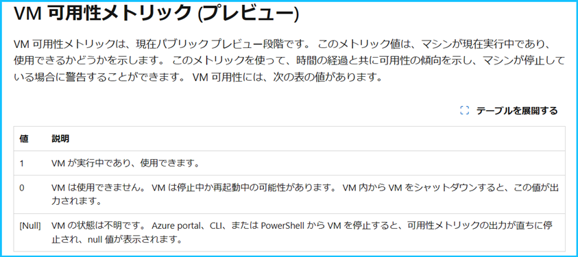
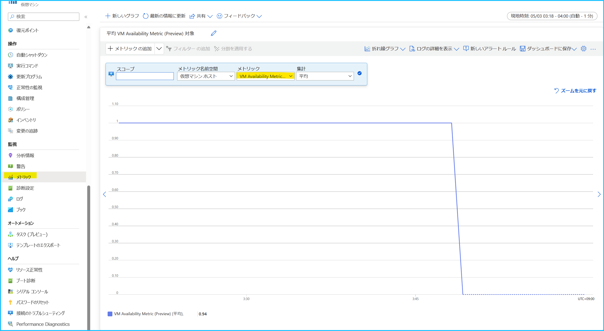
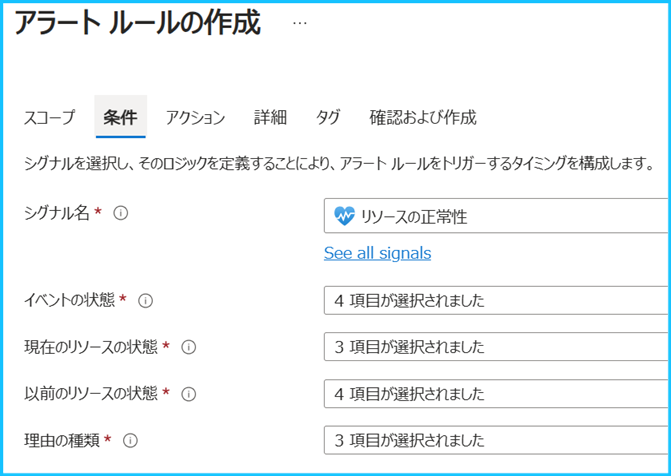
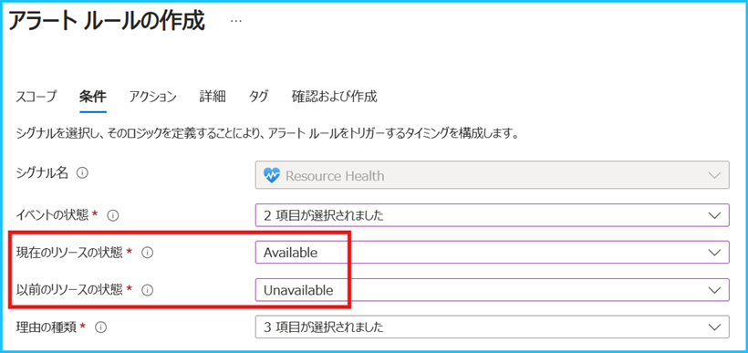
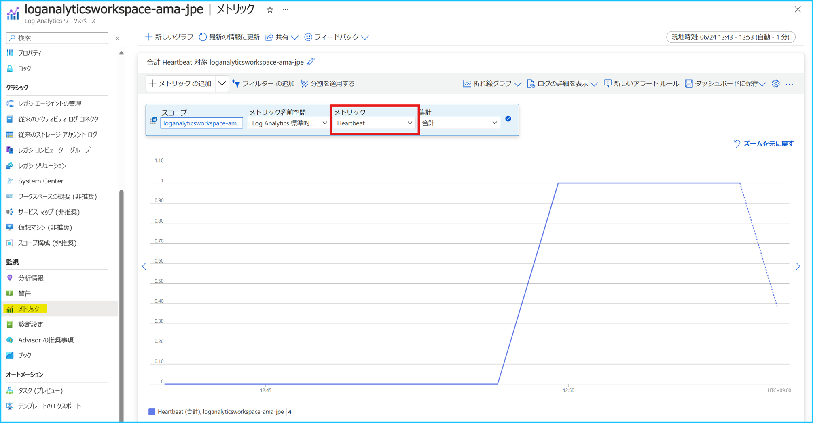

こんにちは、Azure Monitoring チームの北村です。
今回は、Azure Monitor による Azure VM の死活監視の考え方についてご紹介したいと思います。

<!-- more -->
## 目次
- [1. はじめに](#1-はじめに)
- [2. 各レイヤーの監視方法](#2-各レイヤーの監視方法)
- [3. VM ホストの監視](#3-VM-ホストの監視)
  - [3-1. メトリック ‘VM Availability Metric (Preview)’ を監視する方法](#3-1-メトリック-‘VM-Availability-Metric-Preview-’-を監視する方法)
  - [3-2. リソース正常性を監視する方法](#3-2-リソース正常性を監視する方法)
- [4. VM ゲストの監視](#4-VM-ゲストの監視)
  - [4-1. Heratbeat を利用したログ アラート](#4-1-Heratbeat-を利用したログ-アラート)
  - [4-2. Heartbeat を利用したログのメトリック アラート](#4-2-Heartbeat-を利用したログのメトリック-アラート)
- [5. VM 上で稼働している機能の監視](#5-VM-上で稼働している機能の監視)
- [6. Heartbeat の収集遅延に影響されない監視方法](#6-Heartbeat-の収集遅延に影響されない監視方法)
  - [6-1. アラートの評価期間を長めに設定する](#6-1-アラートの評価期間を長めに設定する)
  - [6-2. アラートのしきい値を緩和する](#6-2-アラートのしきい値を緩和する)
  - [6-3. Heartbeat を利用したアラートではなく、VM Availability Metric (Preview) やリソース正常性で監視する](#6-3-Heartbeat-を利用したアラートではなく、VM-Availability-Metric-Preview-やリソース正常性で監視する)

 

## 1. はじめに
Azure VM の死活監視にはいくつか方法がありますが、Heartbeat を利用した監視をご利用されている方が多いかと思います。

Heartbeat は Azure Monitor エージェントや Log Analytics エージェントによって Log Analytics ワークスペースに収集されます。
エージェントによって収集されるログは、基本的にはログが生成されてから 20 秒から 3 分程度で Log Analytics ワークスペースで検索可能となります。しかし、Azure サービスの負荷が高い場合や Azure 基盤側で障害が発生している場合等、様々な要因でログの収集に遅延が生じたり、ログが欠損することがあります。このような状況では Azure VM 自体は正常に稼働していても、アラートが発報する可能性があります。

弊社 Azure サービスでは、お客様の環境に影響を及ぼす障害が発生しないように日々サービスの品質向上に努めておりますが、
ログの収集遅延や欠損が発生する障害が発生した際には、アラートの誤検知に関するお問い合わせを沢山いただきます。

このような障害が発生した際、Heartbeat による死活監視のみを利用されている場合には、大変心苦しいのですが障害が解消されるまでお待ちいただくしかありません。そのため、弊社としては Heartbeat 以外の死活監視方法を代替案としてご案内させていただいたり、障害が発生した場合でも死活監視を継続できるように死活監視の冗長化を推奨しております。

今回は、VM の監視方法をレイヤーに分けてご紹介します。
お客様には誠に申し訳ございませんが、Heartbeat を含むどの監視方法も 100% の信頼性を保証することはできません。
Heartbeat を利用した監視だけではなく、他の監視方法も併用することで障害時でも VM の監視を継続できるようになります。
また、Heartbeat の収集遅延の影響を受けずに監視する場合には、Heartbeat 以外を利用した監視方法をご検討ください。
各レイヤーの監視方法の特性と内容をご確認いただき、お客様のご要件に合った監視方法や、監視の冗長化をご検討いただけますと幸いです。

> [!IMPORTANT]
> Log Analytics エージェントは 2024 年 8 月に廃止されるため、Azure Monitor エージェントへの移行をお願いしております。詳細は [弊社公開情報](https://learn.microsoft.com/ja-jp/azure/azure-monitor/agents/azure-monitor-agent-migration) や [弊社サポート ブログ](https://jpazmon-integ.github.io/blog/LogAnalytics/HowToMigrateToAmaFromLA/) をご覧ください。

 

## 2. 各レイヤーの監視方法
各レイヤーの VM の監視方法を記載します。
複数のアラートで同時に VM の異常を検知した際に VM の状態を確認するなど、お客様のご状況に沿った方法の使用をご検討いただければ幸いです。

| レイヤー                     | アラート                                            |
| ---------------------------- | --------------------------------------------------- |
| VM ホストの監視              | VM Availability Metric (Preview)  リソース正常性 |
| VM ゲストの監視              | Heartbeat                                           |
| VM上で稼働している機能の監視 | 可用性テスト                                        |

 

## 3. VM ホストの監視
VM ホストは、以下の方法で監視できます。

- メトリック 'VM Availability Metric (Preview)' を監視する方法
- リソース正常性を監視する方法

 

### 3-1. メトリック 'VM Availability Metric (Preview)' を監視する方法
[VM Availability Metric (Preview) （VM 可用性メトリック (プレビュー)）](https://learn.microsoft.com/ja-jp/azure/virtual-machines/monitor-vm-reference#vm-availability-metric-preview)は Azure VM のホストが出力するメトリックであり、VM の可用性を確認することができます。このメトリックは Heartbeat 収集する Azure Monitor エージェントや Log Analytics エージェントとは関係ないため、エージェントから Log Analytics ワークスペースへのログの出力に問題が発生した際もメトリックは出力されます。

VM Availability Metric (Preview) の値が 1 の場合は、VM が実行中であり、利用可能であることを表します。
つまり、この値が 1 より小さい場合には VM の可用性が低下していることになりますので、このメトリックを監視するメトリック アラートを構成することで、VM の可用性が低下した場合に発報させることが可能です。
このメトリックを利用したアラート ルールの設定方法については、[こちら](https://learn.microsoft.com/ja-jp/azure/azure-monitor/vm/tutorial-monitor-vm-alert-availability#view-vm-availability-metric-in-metrics-explorer)の弊社公開情報をご参照ください。

 

### 3-2. リソース正常性を監視する方法
リソース正常性アラートでは、リソースの正常性に変化が生じた際に通知できます。
リソースの状態に変化が発生すると、アクティビティ ログに正常性に関するイベントが書き込まれ、アラートで指定した条件に合致した場合に発報します。Azure VM のリソース正常性では、[以下の項目](https://learn.microsoft.com/ja-jp/azure/service-health/resource-health-checks-resource-types#microsoftcomputevirtualmachines)をチェックします。この項目に該当するようなイベントが発生した場合に、リソースの正常性に変化が発生したと判断されます。

リソース正常性では、リソースに変化が発生した際に、リソースの現在と過去の正常性 (リソースの状態) について報告します。
リソース正常性アラートで指定する条件は以下であり、"現在のリソースの状態" と "過去のリソースの状態" や、"イベントの状態"、イベントが発生した "理由の種類" を指定できます。

"イベントの状態" が Active である場合、リソースの正常性が異常な状態であることを表し、Resolved に変化した場合、異常な状態から正常な状態に遷移したことを表します。"リソースの状態" が Unavailable はリソースが利用可能でないことを意味し、Available はリソースが利用可能であることを意味します。

つまり、以下の設定にすると、
リソースの状態が 「Available」 の状態から 「Unavailable」 に遷移したタイミングと、
リソースの状態が 「Unavailable」 の状態から 「Available」 に遷移したタイミングでアラートがトリガーされ、リソース正常性に変更が発生したタイミング、解消したタイミングで通知を受け取ることが可能です。

■ イベントの状態 :  Active, Resolved
■ 以前のリソースの状態 : Available, Unavailable
■ 現在のリソースの状態 : Unavailable, Available,

VM のリソース正常性アラート ルールの設定方法については、[こちら](https://learn.microsoft.com/ja-jp/azure/service-health/resource-health-overview)の弊社公開情報や、[弊社サポート ブログ](https://jpazmon-integ.github.io/blog/AzureMonitorEssential/ResourceHealthAlert/)も併せてご確認ください。

 

## 4. VM ゲストの監視
VM ゲストは、以下の方法で監視できます。

- Heratbeat を利用したログ アラート
- Heartbeat を利用したログのメトリック アラート

 

### 4-1. Heratbeat を利用したログ アラート
Heartbeat は Log Analytics エージェントや Azure Monitor エージェントによって Log Analytics ワークスペースに収集されます。
Log Analytics ワークスペースに収集された Heartbeat を利用して、死活監視のログ アラート ルールを構成することが可能です。
例えば、直近 10 分以内に Heartbeat が収集されていることを確認するログ アラート ルールが発報した場合、アラートが実行された時点から 過去 10 分以内に Heartbeat が途絶えたことになり、該当のマシンにて何らかの問題が発生している可能性がございます。なお、Heartbeat のログ アラートが発報したとしても、必ずしも仮想マシンに問題が発生しているとは限りません。エージェント自体に問題が発生している場合や、ログの収集遅延によってアラートが発報する場合もございます。
<!--- https://jpazmon-integ.github.io/blog/LogAnalytics/MonitorVM/ --->

 

### 4-2. Heartbeat を利用したログのメトリック アラート
[ログのメトリック アラート](https://learn.microsoft.com/ja-jp/azure/azure-monitor/alerts/alerts-metric-logs)は、Azure Montior エージェントや Log Analytics エージェントで収集されたログをメトリックに変換し、メトリックを評価するアラート ルールです。

ログが生成され、Log Analytics のエンドポイントに対してログを送信し、メトリックに変換されてメトリックを検索できるようになるまでの時間と、ログが生成され、Log Analytics のエンドポイントに対してログを送信し、Log Analytics ワークスペース上でアラートの検索クエリでログを検索できるようになるまでの時間を比較した場合、前者の方が早く処理が実施されます。このため、ログ アラート ルールと比較し、「ログのメトリック アラート」の方がよりリアルタイムに近い監視が可能です。

なお、ログ アラートと同様、Heartbeat メトリックが途絶えたとしても、マシンに問題が発生しているとは限りません。
ログが生成され Log Analytics のエンドポイントに到着するまでの間に遅延が発生していた場合には、ログのメトリック アラートでも遅延の影響を受けてアラートが発報します。Log Analytics のエンドポイントに到着するまでの間に遅延が発生すると、メトリックの変換も遅延し、結果的にメトリックの収集遅延が発生するためです。また、Azure Monitor の基盤側の問題により、変換されたメトリックが欠損してしまう可能性があり、欠損の影響でアラートが発報することも考えられます。

 

## 5. VM 上で稼働している機能の監視
VM で動作するアプリケーションの死活監視を行います。
ホストやゲストの監視に異常が発生しても、アプリケーションが正常に動作していれば VM に異常は発生していないと判断できる場合もあります。

アプリケーションは Application Insights の[可用性テスト](https://learn.microsoft.com/ja-jp/azure/azure-monitor/app/availability-overview)を使用して死活監視できます。
可用性テストは弊社の世界各地のサーバーから定期的にアプリケーションに Web リクエストを送信し可用性を確認する機能です。

可用性テストは、「メトリック 'VM Availability Metric (Preview)' を監視する方法」、「Heartbeat を利用した監視方法」および「リソース正常性を監視する方法」とは独立した機能です。アプリケーションが動作している際に Heartbeat に異常が発生しても、可用性テストが正常であればアプリケーションに問題は起きておらず、VM も正常に動作していると判断いただけます。[可用性テストの設定方法](https://learn.microsoft.com/ja-jp/azure/azure-monitor/app/availability-standard-tests)及び、[アラート ルールの設定方法](https://learn.microsoft.com/ja-jp/azure/azure-monitor/app/availability-alerts) は、公開情報をご参照いただけますと幸いです。

なお、標準テストは、インターネットからアクセスできるエンドポイントが必要です。
もしプライベート ネットワークからのみを許可する機能の監視を行う必要がありましたら、弊社サポート ブログでご案内しております [Azure Functions を使用した可用性テスト](https://jpazmon-integ.github.io/blog/applicationInsights/privateAvailabilityTestSampleCode/)を作成いただけますと幸いです。

 

## 6. Heartbeat の収集遅延に影響されない監視方法
Heartbeat のログ アラートやログのメトリック アラートを構成されているお客様から「VM は正常に稼働しているがアラートが発報したため、原因を調査してほしい」というお問い合わせをいただくことがあります。こういったお問い合わせで原因を調査しますと、ログの収集が遅延していた影響でアラートが発報しているケースが多く見受けられます。

[ログ データを取り込むための一般的な待ち時間は 20 秒から 3 分](https://learn.microsoft.com/ja-jp/azure/azure-monitor/logs/data-ingestion-time#average-latency)です。
Heartbeat のアラートを構築しているお客様には申し訳ございませんが、以下の要因等によりログの取り込みに遅延が発生する場合がございます。

- Azure Monitor エージェントや Log Analytics エージェントがインストールされたコンピューターに一時的に負荷が発生し、エージェントの動作に影響した。
- 何らかの原因で Azure Monitor エージェントや Log Analytics エージェントが停止していた。
- 何らかの原因でネットワークに異常が発生し、クライアントから Log Analytics ワークスペースへのデータ送信に失敗。エージェント側の再試行処理により、データの取り込みに時間を要した。
- Azure 基盤側で問題が発生し、Log Analytics ワークスペース上でクエリ検索できるまでに時間を要した

また、ログのメトリック アラートではエージェントから Log Analytics のエンドポイントにデータが送信された後、基盤側でログをメトリックに変換します。そのため、Log Analytics のエンドポイントにデータが到着するまでに遅延が発生した場合や、メトリックへの変換処理にて遅延が発生した場合には、ログのメトリック アラートでも収集遅延による誤検知が発生する可能性がございます。

Heartbeat の収集遅延に影響されない監視方法について聞かれることがよくありますが、
弊社サポートとしては基本的に以下 3 つのことをご検討いただくことをご案内しております。

- アラートの評価期間を長めに設定する
- アラートの閾値を緩和する
- Heartbeat を利用したアラートではなく、VM Availability Metric (Preview) やリソース正常性で監視する

 

### 6-1. アラートの評価期間を長めに設定する
ログの収集遅延に起因したアラートの発報を減らす方法として、アラートの評価期間を長めに設定いただくことを推奨しております。Log Analytics ワークスペースに収集されるデータや、ログからメトリックに変換するデータでは、収集遅延や待機時間が発生いたします。

「アラートの評価期間」とは、1 回の評価を行う際に評価の対象となる期間を意味します。
[ログ アラート](https://learn.microsoft.com/ja-jp/azure/azure-monitor/alerts/alerts-create-log-alert-rule)の場合は [集計の粒度]、[ログのメトリック アラート](https://learn.microsoft.com/ja-jp/azure/azure-monitor/alerts/alerts-create-metric-alert-rule)の場合は [ルックバック期間] に該当します。この [集計の粒度] や [ルックバック期間] が短ければ短いほど (例. 1 分や 5 分) 、収集遅延の影響を受けやすくなります。

ログ アラートやログのメトリック アラートでは、ログの TimeGenerated やメトリックの timestamp をもとに評価期間内のデータを検索します。アラート ルールの評価時点でログやメトリックが取り込まれていない場合、アラートのしきい値を満たしてアラートが発報してしまいます。ログやメトリックの収集遅延により期待しないアラート発報を緩和させるためには、[集計の粒度] や [ルックバック期間] をより長い期間へとご指定いただけますと幸いです。

 

### 6-2. アラートのしきい値を緩和する
Heartbeat のログ アラートで以下のように設定していたとします。
この場合、[評価の頻度] の 5 分毎に、直近 5 分以内に収集された Heartbeat のレコード数が [しきい値] の 3 以下であった場合に発報します。アラートのしきい値を緩和する場合には、例えば、[しきい値] を 「3 以下」から「0 以下」に設定する方法が考えられます。

- メジャー: テーブルの行
- 集計の種類: カウント
- 集計の粒度: 5 分 
- 演算子: 次の値以下
- しきい値: 3
- 評価の頻度: 5分

 

### 6-3. Heartbeat を利用したアラートではなく、VM Availability Metric (Preview) やリソース正常性で監視する
ログやメトリックを取り込むまでに遅延が発生する場合がございます。
エージェントや Log Analytics 基盤等による収集遅延を受けない監視方法として、リソース正常性や VM Availability Metric (Preview) を監視する方法をご検討ください。

 

上記の内容以外でご不明な点や疑問点などございましたら、弊社サポート サービスまでお問い合わせください。
最後までお読みいただきありがとうございました！