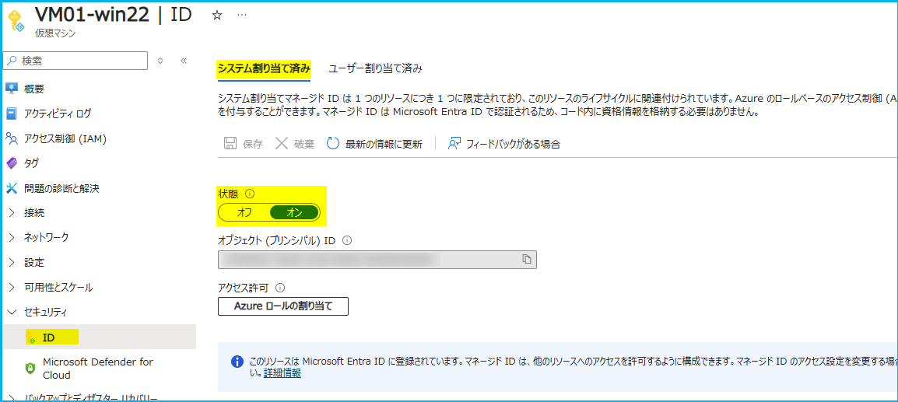

こんにちは、Azure Monitoring チームの徳田です。

Azure Monitor エージェントを使用したログ収集を行っている場合、Log Analytics ワークスペースには、Heartbeat と呼ばれるログが 1 分毎に収集されます。
この Heartbeat はマシンの死活監視にも使用されることがありますが、何らかの理由でこの Heartbeat が収集されないことがあります。
Heartbeat が収集できていない場合は、ログ収集設定以前もところで問題が発生していることも多く、その場合は、Heartbeat 以外のログ収集も停止してしまいます。

今回は、Heartbeat をはじめとしたログが収集されないときの、はじめのトラブルシューティング方法をご紹介します。

https://learn.microsoft.com/ja-jp/azure/azure-monitor/agents/azure-monitor-agent-troubleshoot-windows-vm

https://learn.microsoft.com/ja-jp/azure/azure-monitor/agents/azure-monitor-agent-troubleshoot-linux-vm


## 目次


## ステップ: VM の起動状態
まずはじめに確認すべきことは、マシンが正常に起動した状態であるかです。
マシンが起動していない場合は、ログ収集が行われません。  

**確認方法**   
Azure portal では、対象のマシンの [概要] ページ内の "基本" > "状態" からご確認いただけます。

**マシンが起動していないときの対処方法**
マシンが起動されていない場合 ("状態" が "停止済み" となっている場合) は、起動させ、ログ収集が再開するかどうかをご確認ください。

## ステップ: Azure Monitor エージェントの状態
VM が問題なく起動していても、Azure Monitor エージェントが正常に稼働していない場合があります。  

**確認方法**
Azure portal で対象の VM を開き、左ペインの [設定] > [拡張機能とアプリケーション] を開きます。   
Linux VM の場合は "AzureMonitorLinuxAgent"、Windows VM の場合は "AzureMonitorWindowsAgent" の "状態" が "Provisioning Succeeded" となっている場合は、Azure Monitor エージェントが正常に稼働していることを意味します。

**Azure Monitor エージェントが "Provisioning Succeeded" 出ない場合の対処方法**
- Azure Monitor エージェントの状態が "Provisioning Succeeded" になっていない場合は、一度 VM 自体を再起動し、しばらく待って "Provisioning Succeeded" になるかをご確認ください。  
- それでも "Provisioning Succeeded" とならない場合は、エージェントの再インストールをお試しください。これにより事象が解決する場合があります。

## ステップ: 通信要件
マシンにインストールされた Azure Monitor エージェントがマシンのログを Log Analytics ワークスペースに送信したい場合は、マシン (Azure Monitor エージェント) が必要なエンドポイントに、通信できるよう設定する必要があります。  

通信できる必要のあるエンドポイントは以下の通りです。  

`global.handler.control.monitor.azure.com`  

`<virtual-machine-region-name>.handler.control.monitor.azure.com` 

`<log-analytics-workspace-id>.ods.opinsights.azure.com`  

Log Analytics ワークスペース内のカスタム ログ テーブルにデータを送信する場合は、以下のエンドポイントへの通信も必要です。  
`<data-collection-endpoint>.<virtual-machine-region-name>.ingest.monitor.azure.com`  
＊ 実際の値は、使用しているデータ収集ルールに設定しているデータ収集エンドポイントを Azure portal で開き、[概要] の "ログ インジェスト" を確認してください。  
   こちらに記載されている値から "https://" を除いたものがエンドポイントです。  
   

**確認方法**   
上記エンドポイントへ通信できているかどうかは、以下の方法で確認可能です。  

■ Windows の場合  
以下のコマンドを実行し、出力結果に `TcpTestSucceeded : True` が記載されていれば、エンドポイントに通信できています。  
( `<endpoint>` の箇所は、上記のエンドポイントに置き換えてください)
```
Test-NetConnection <endpoint> -port 443
```  
(結果例)  


■ Linux の場合  
以下のコマンドを実行し、出力結果に `CONNECTED` が記載されていれば、エンドポイントに通信できています。  

```
Test-NetConnection <endpoint> -port 443
```  
(結果例)  


**エンドポイントへ通信できていない場合の対処方法**  
ネットワーク構成を確認し、エンドポイントへの通信を拒否するような設定が適用されていないかを確認してください。  
プロキシ サーバーやロード バランサーなどを介してログを送信するよう構成している場合は、プロキシ サーバーやロード バランサーのネットワーク設定も確認してください。


## データ収集ルールの設定
Azure Monitor エージェントを使用してログ収集を行う場合、データ収取ルールを使用して、対象のマシンと、ログ収集先の Log Analytics ワークスペースを指定します。  
確認対象のマシンが、データ収集ルールに関連付けられているか、ログ収集を確認している Log Analytics ワークスペースが合っているかを、確認してください。

**確認方法**  
■ マシンとデータ収集ルールの関連付け 
1. Azure portal でデータ収集ルールのリソース ページを開きます。  
2. 左ペインの [構成] > [リソース] を開きます。  
   ここに、確認対象のマシンが表示されていることを確認してください。

■ ログ収集先の Log Analytics ワークスペース  
1. Azure portal でデータ収集ルールのリソース ページを開きます。  
2. 左ペインの [構成] > [データ ソース] を開きます。  
3. 表示されているデータ ソースを押下し、右ペインの [ターゲット] タブを開きます。  
   ここに表示される Log Analytics ワークスペースに、ログが収集されます。  
   


## マネージド ID の設定
Azure Monitor エージェントを使用する場合は、マシンにシステム割り当てマネージド ID が割り当てられている必要があります。  

**確認方法** 
1. Azure portal で確認対象のマシンを開きます。  
2. 左ペインの [セキュリティ] > [ID] を押下し、[システム割り当て済み] タブを開きます。  
   "状態" が "オン" になっていれば、そのマシンにはシステム割り当てマネージド ID が割り当てられています。  
   

**システム割り当てマネージド ID が割り当てられていないときの対処方法**  
以下の手順で、システム割り当てマネージド ID を割り当ててください。  
1. Azure portal で確認対象のマシンを開きます。  
2. 左ペインの [セキュリティ] > [ID] を押下し、[システム割り当て済み] タブを開きます。  
3. "状態" の "オン" を押下し、しばらく待つと、システム割り当てマネージド ID が割り当てられます。