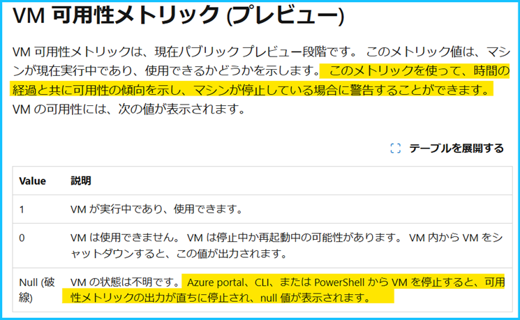
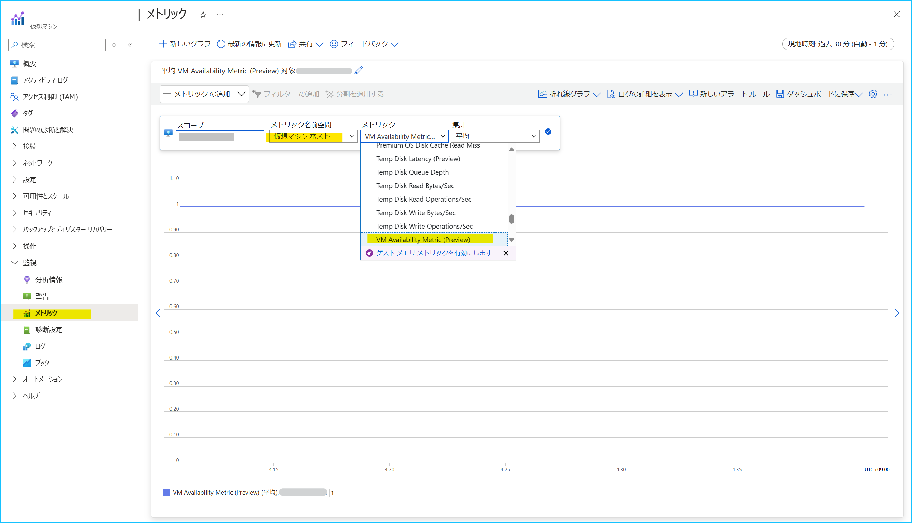
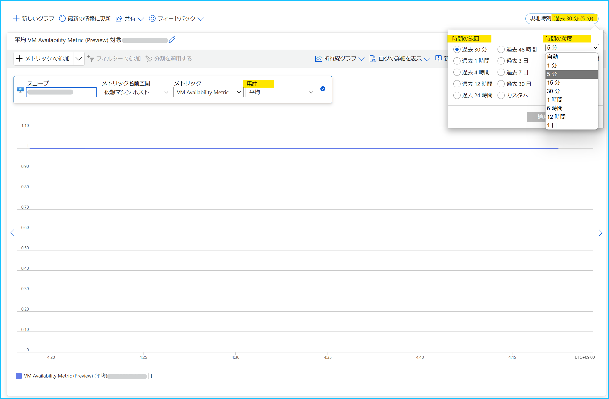
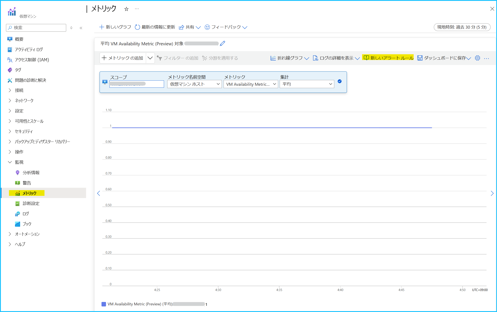
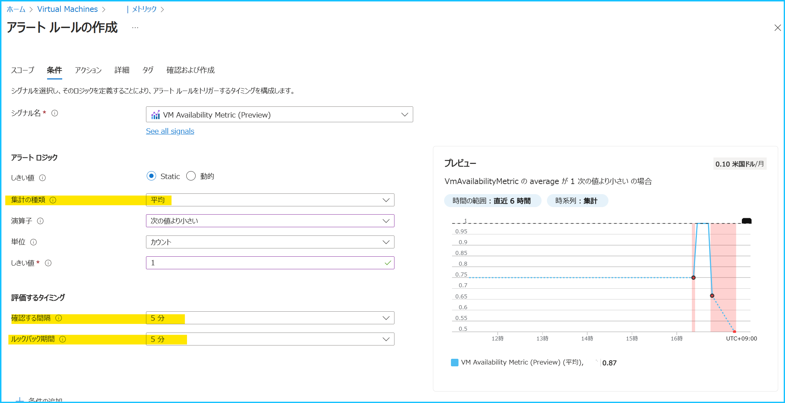
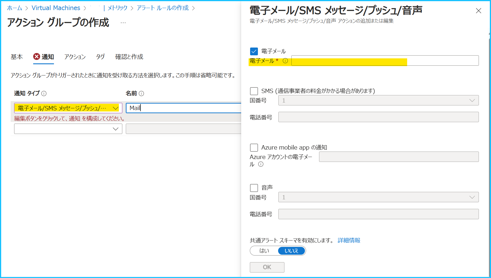
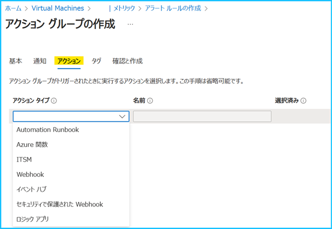
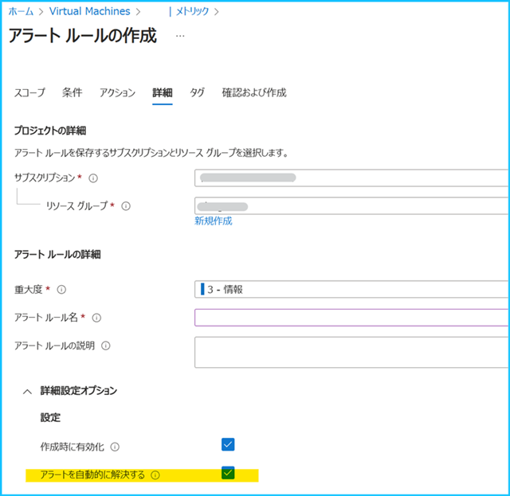
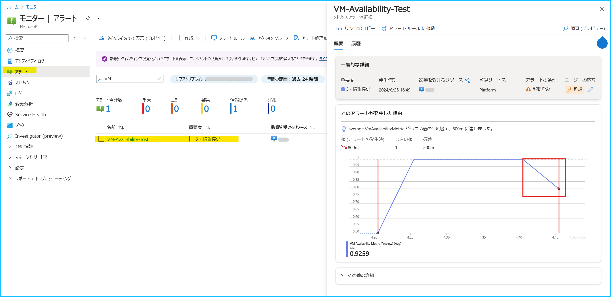

こんにちは、Azure Monitoring チームの北村です。
今回は Azure VM のホストが出力するメトリック ‘VM Availability Metric (Preview)’ を利用したメトリック アラートの設定方法をご紹介します。

 

<!-- more -->
## 目次
- [1. はじめに](#1-はじめに)
- [2. 可用性メトリック ‘VM Availability Metric (Preview)’ とは](#2-可用性メトリック-‘VM-Availability-Metric-Preview-’-とは)
- [3. 可用性メトリック ‘VM Availability Metric (Preview)’ のメトリック アラート設定手順](#3-可用性メトリック-‘VM-Availability-Metric-Preview-’-のメトリック-アラート設定手順)

 

## 1. はじめに
[Azure VM の死活監視にはいくつか方法があります](https://jpazmon-integ.github.io/blog/LogAnalytics/MonitorVM02/)。
Azure Monitor エージェントによって収集される Heartbeat を利用した監視をご利用されている方が多いかと思いますが、
今回は可用性メトリック ‘VM Availability Metric (Preview)’ のメトリック アラートの設定方法をご紹介します。

VM Availability Metric (Preview) （VM 可用性メトリック (プレビュー)）は Azure VM のホストが出力するメトリックであり、VM ホストを監視することができます。このメトリックを利用したメトリック アラートを構成することで、VM の可用性が低下していることを検知することができます。

 

## 2. 可用性メトリック ‘VM Availability Metric (Preview)’ とは
可用性メトリックは Azure VM のホストが出力するメトリックです。[ホスト メトリック](https://learn.microsoft.com/ja-jp/azure/azure-monitor/reference/supported-metrics/microsoft-compute-virtualmachines-metrics)は仮想マシンを作成すると自動的に収集されます。このホスト メトリックの中で、VM の可用性を表すメトリックが「VM Availability Metric (Preview)」です。

このメトリックの値が 1 の場合は VM が実行中であり、利用可能であることを表します。
このメトリックの値が 0 の場合は VM を利用できない状態であることを意味します。
つまり、このメトリックの値が 1 を下回ったことを検知するアラートを作成いただくことで、VM ホストにおける可用性を監視することができます。

ご注意いただきたい点は、このメトリックでは **Azure VM が "停止済み (割り当て解除) " を検知することができない**ことです。
VM が "停止済み (割り当て解除)" の場合は、メトリックの値が [NULL](https://learn.microsoft.com/ja-jp/azure/virtual-machines/monitor-vm-reference#vm-availability-metric-preview) になります。
しかし、メトリック アラートではメトリックの値が [NULL](https://learn.microsoft.com/ja-jp/azure/azure-monitor/essentials/metrics-aggregation-explained#null-and-zero-values) であることを検知できませんので、予めご留意ください。

 

## 3. 可用性メトリック ‘VM Availability Metric (Preview)’ のメトリック アラート設定手順
それでは、可用性メトリック ‘VM Availability Metric (Preview)’ のメトリック アラートを設定してみましょう！
本記事では 5 分おきにメトリックの値を確認し、過去 5 分以内に記録された可用性メトリックの平均値が 1 を下回った場合に発報するメトリック アラートを設定します。

 

**1). 監視対象の Azure VM のメトリック エクスプローラーを開きます。**
Azure portal にログインし、監視対象の Azure VM を開きます。
Azure VM のリソース メニュー [メトリック] を選択し、VM Availability Metric (Preview) のメトリックを表示します。
[メトリックの名前空間] で「仮想マシン ホスト」を選択し、[メトリック] で「VM Availability Metric (Preview)」を検索してください。

下図では [集計] で「平均」を選択していますが、これは指定した期間のメトリックを集計する方法を意味します。
例えば、以下の場合は [時間の範囲] で指定した過去 30 分以内に記録されたメトリックを、[時間の粒度] の 5 分間隔でキャプチャされたメトリック値の平均が表示されます。可用性メトリックでは、平均、最小値、最大値の集計方法がサポートされています。

> [!NOTE]
> メトリック エクスプローラーの使い方は、[弊社公開情報](https://learn.microsoft.com/ja-jp/azure/azure-monitor/essentials/analyze-metrics) をご参照ください。また、メトリックの集計の考え方につきましては、[こちら](https://learn.microsoft.com/ja-jp/azure/azure-monitor/essentials/metrics-aggregation-explained#aggregation-types) の公開情報をご覧ください。

 

**2). メトリック アラートの発報条件を指定します。** 
VM Availability Metric (Preview) のメトリックを表示できましたら、画面上部の [新しいアラート ルール] をクリックします。

この画面では、アラートの発報条件を指定します。メトリック アラートの評価に関わる主な項目は以下のとおりです。

- 確認する間隔 : 評価を行う頻度
- ルックバック期間 : 1 回の評価を行う際に評価の対象となる期間
- 集計の種類 : [ルックバック期間] で指定した期間のメトリックを集計する方法

[確認する間隔] は評価を行う頻度であり、「何分おきに評価を行うか」を表します。
[ルックバック期間] は「1 回の評価を行う際に評価の対象となる期間」を表します。
今回は 5 分おきに評価を行い、過去 5 分以内に記録された可用性メトリックの平均値が 1 を下回った場合に発報させたいので、以下の通り設定します。

- シグナル名 : VM Availability Metric (Preview) 
- しきい値 : Static
- 集計の種類 : 平均
- 演算子 : 次の値より小さい
- 単位 : カウント
- しきい値 : 1
- 確認する間隔 : 5 分
- ルックバック期間 : 5 分

---
**<補足> Azure VM のライブ マイグレーションによる可用性メトリックの影響について**
Azure VM のライブ マイグレーションの影響で、一時的に VM Availability Metric (Preview) の値が 1 ではなく 0 と出力される可能性がございます。この場合、直近 5 分間の VM Availability Metric (Preview) の平均値が 1 を下回り、Azure VM が稼働しているのにも関わらず期待しないアラートが発報する恐れがございます。もしライブ マイグレーションの影響によるメトリック アラートの発報を回避されたい場合は、アラート発報条件を見直していただくことをご検討ください。

- 例 : 5 分間のうち、1 分間メトリック値が 0 だった場合を許容したい
シグナル名 : VM Availability Metric (Preview)
しきい値 : Static
集計の種類 : 平均
演算子 : 次の値より小さい
単位 : カウント
しきい値 : 0.8
確認する間隔 : 5 分
ルックバック期間 : 5 分

- 例 : 5 分間連続でメトリック値が 0 だった場合にアラートを発報したい
シグナル名 : VM Availability Metric (Preview)
しきい値 : Static
集計の種類 : 最大
演算子 : 次の値より小さい
単位 : カウント
しきい値 : 1
確認する間隔 : 5 分
ルックバック期間 : 5 分
---

> [!NOTE]
> メトリック アラートの設定項目につきましては、[弊社公開情報](https://learn.microsoft.com/ja-jp/azure/azure-monitor/alerts/alerts-create-metric-alert-rule)をご覧ください。

 

**3). アラートで通知する方法を指定します。**
Azure Monitor のアラート機能では、[アクション グループ](https://learn.microsoft.com/ja-jp/azure/azure-monitor/alerts/action-groups) というリソースでアラートを通知する方法を定義します。新規で作成する場合は [+ アクション グループの作成]、既存のグループを指定する場合は [+ アクション グループの選択] をクリックします。

例えば、アラートをメールで通知する場合には、[通知のタイプ] で "電子メール/SMS メッセージ/プッシュ/音声" を選択し、通知するメール アドレスを指定します。

また、[アクション] では、アクション グループがトリガーされた際に実行するアクションを選択できます (今回は設定しません)。

> [!NOTE]
> アクション グループの概要や設定手順につきましては、[弊社公開情報](https://learn.microsoft.com/ja-jp/azure/azure-monitor/alerts/action-groups#create-an-action-group-in-the-azure-portal)をご覧ください。

 

**4. アラート ルールの名前、アラートの重大度等を設定します。**
[アラート ルールの詳細] では、重大度、アラート ルール名、アラート ルールの説明を設定します。
[詳細設定オプション] では、アラート ルールの有効化や自動解決を設定します。

**[アラートを自動的に解決する] にチェックをいれた場合には、アラートの閾値を満たす度にアラートは発報しません。**
このようなアラートは "[ステートフルなアラート](https://learn.microsoft.com/ja-jp/azure/azure-monitor/alerts/alerts-overview#alerts-and-state)" と呼ばれ、アラートの閾値を満たしたときに一度発報し、アラートが解決したとみなされたときに、解決したことが通知されます。メトリック アラートの場合は、[3 回連続で閾値を満たさなかった場合に解決したとみなされます](https://learn.microsoft.com/ja-jp/azure/azure-monitor/alerts/alerts-overview#stateful-alerts)。

**[アラートを自動的に解決する] にチェックをいれない場合は、アラートの閾値を満たす度にアラートが発報します。** お客様のご要件に合わせてご設定ください。

> [!NOTE]
> ステートフルなアラートの詳細につきましては、[弊社公開情報](https://learn.microsoft.com/ja-jp/azure/azure-monitor/alerts/alerts-overview#stateful-alerts)をご覧ください。

 

**5). 最後に設定した内容を確認し、[作成] をクリックします。**
手順は以上です。

アラートの履歴は、Azure portal にログインいただき、[モニター] > [アラート] から確認いただけます。
以下の例では、アラートの評価時点から過去 5 分間の可用性メトリック ‘VM Availability Metric (Preview)’ の平均値が 1 を下回ったため、アラートが発報していることが分かります。

本記事の冒頭でもお伝えしておりますとおり、**Azure VM の死活監視には複数の方法がございます**。
[Azure VM における死活監視の考え方](https://jpazmon-integ.github.io/blog/LogAnalytics/MonitorVM02/) のブログもご覧いただき、お客様のご要件に合った監視設定を構築いただけますと幸いです！
上記の内容以外でご不明な点や疑問点などございましたら、弊社サポート サービスまでお問い合わせください。
最後までお読みいただきありがとうございました！
